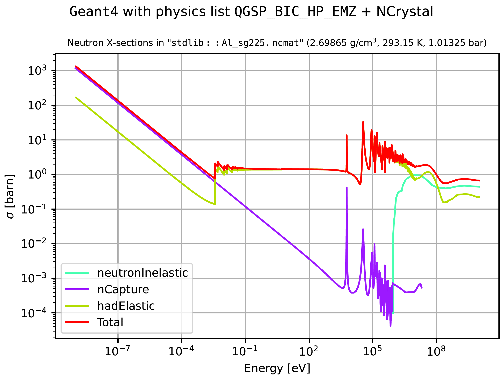
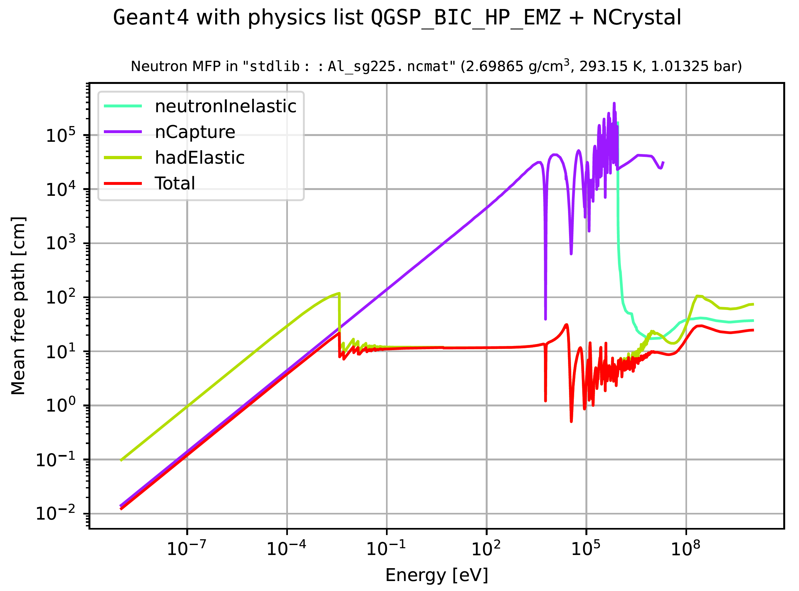
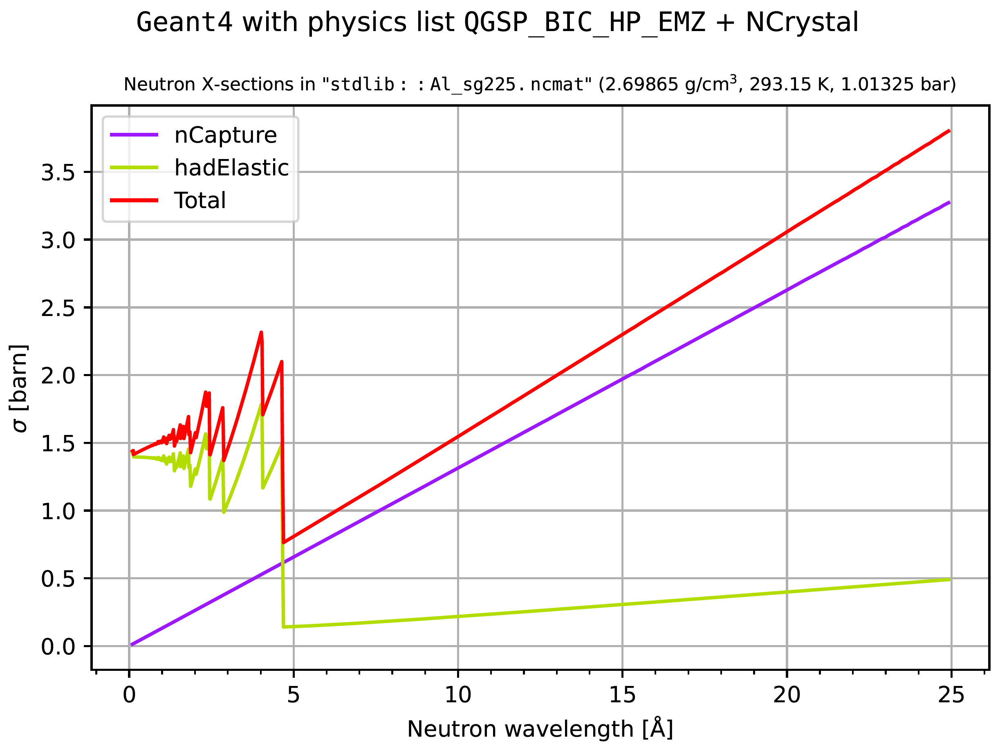
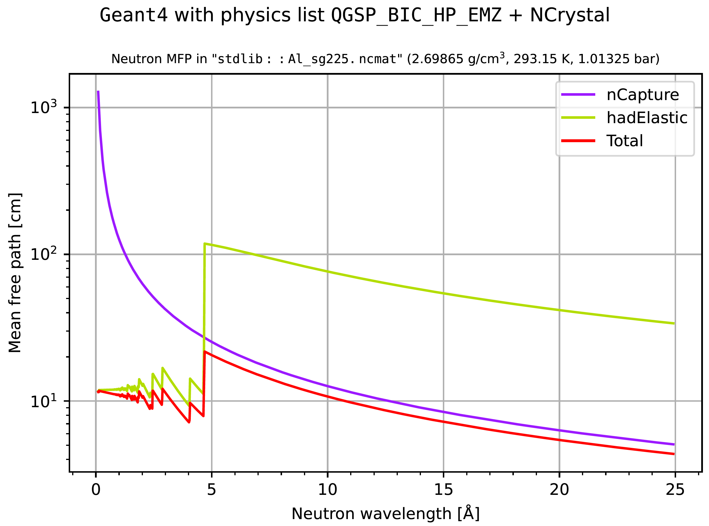

Extract and investigate cross sections from Geant4
***************************************************

.. include:: wipwarning.rst

While possible, it is is not in general straight-forward to extract information
about applied cross sections and associated mean free path lengths from
Geant4. Therefore, a custom hook was created in dgcode the FIXME `G4XSectDump
<https://github.com/mctools/dgcode/tree/main/packages/Framework/Utils/XSectUtils/G4XSectDump>`__
simplebuild package , which can be used to perform said extraction. It works by
intercepting particles as they are being simulated inside an actual Geant4 job,
thus resulting in a higher degree of certainty than if one would attempt to
interpret the various Geant4 data files and C++ code directly.

.. note::

   If your material is defined by an :ref:`NCrystal cfg-string
   <sbmatdef_ncrystalcfgstrings>`, you can additionally use the ``nctool``
   command to investigate the material, to get more detailed information about
   the thermal (<5eV) neutron scattering cross sections (for more information
   see :ref:`here <sbmatdef_ncrystalcfgstrings>`).

   However, non-neutron, non-scattering, or non-thermal cross sections of the
   material in the Geant4 simulations are not provided by ``nctool``, and must
   be investigated by using the tools discussed on the present page. Dilligent
   users might wish to investigate a given material using both approaches.

.. rubric:: How to extract cross sections

The extraction can be invoked in two ways:

#. A generic command-line switch, ``-x``, exist on all simulation scripts
   (i.e. run ``sb_myproj_sim -x``). Invoking it while launching a simulation job
   will result in cross sections being extracted for all combinations of
   particle types and materials which are actually encountered in the given job.
#. A command-line utility, ``sb_g4xsectdump_query``, exists for extracting and
   displaying information for a requested combination of material, particle type
   and physics list. By default, this command will also launch cross section
   plots automatically.

The results are extracted in the form of custom data files, each file containing
cross section information for one particular combination of particle type,
Geant4 material and Geant4 physics list. In the FIXME `XSectParse
<https://github.com/mctools/dgcode/tree/main/packages/Framework/Utils/XSectUtils/XSectParse>`__
package are utilities which can be used to parse and analyse those files, namely
the ``sb_xsectparse_plotfile`` command and the two Python modules
``XSectParse.ParseXSectFile`` and ``XSectParse.PlotXSectFile``.

.. rubric:: The query script

The query script is used to conveniently handle both the launch of Geant4 and
the creation and analysis of x-section files, all via a simple interface:

FIXME: dynamic:

.. code-block::

  $> sb_g4xsectdump_query -h
  Usage: sb_g4xsectdump_query [options]

  This script allows you to extract cross sections from Geant4, for given
  specified combinations of material, physics list and particle type. Note that
  power users might want to fine-tune the granularity of the extraction by
  setting environment variables G4XSECTSPY_LOGDELTAE (default value 0.005) and
  G4XSECTSPY_NSAMPLE (default value 50).

  Options:
    -h, --help            show this help message and exit
    -p PARTICLE, --particle=PARTICLE
                          Name or PDG code of particle
    -l PHYSLIST, --physlist=PHYSLIST
                          Name of physics list (default QGSP_BIC_HP_EMZ)
    -m MATNAME, --material=MATNAME
                          Material given by NamedMaterialProvider syntax
    -s, --noshow          Don't show extracted cross sections in interactive
                          plots
    -f, --nofile          Don't save plots of extracted cross sections in PDF
                          files
    -w, --wavelengths     Show plots versus neutron wavelength rather than
                          energy

.. rubric:: Examples

Example invocation (more about for what goes into a material definition string
:ref:`here <sbmatdef>`):

.. code-block:: sh

  $> sb_g4xsectdump_query -m 'stdlib::Al_sg225.ncmat'  -l QGSP_BIC_HP_EMZ -p neutron

As in fact, ``QGSP_BIC_HP_EMZ`` is the default :ref:`physics list <sbphyslist>`
and ``neutron`` is the default particle, we could have simply written:

.. code-block:: sh

  $> sb_g4xsectdump_query -m 'stdlib::Al_sg225.ncmat'

Note how the material definition string ``'stdlib::Al_sg225.ncmat'`` was quoted
with ``'`` characters. This is in general a good idea, since such strings might
contain special characters which could be otherwise be interpreted by your
shell.

In addition to launching interactive matplotlib-based cross section plots,
either of the above commands produce a list of data files with cross section
information, a file with a dump of the G4Material, and files with plots like the
following:

|image1|\ |image2|

If additionally ``--wavelengths`` or ``-w`` is supplied on the command line, the
plots would instead show cross sections and mean-free-path lengths as a function
of neutron wavelength (for 0.1 to 25 Å):

|image3|\ |image4|

To investigate per-atom cross sections of particular elements or isotopes, one
can (ab)use the gas-mixture features of NCrystal, to create a simple material
which is modelled as a "noblegas" of such atoms. Here is for example how to
extract cross sections for Fe56:

.. code-block:: sh

  sb_g4xsectdump_query -m 'gasmix::Fe56'

This models the material as a gas of monoatomic molecules (a fake noble gas),
and at default pressure and temperature values of 1atm and 293.15K
respectively. Pressure and temperature could of course be overridden via
additional parameters, but it most likely does not make much sense to worry
about such details anyway, since Fe56 does not actually exist as a gas of
monoatomic molecules. Do note that mean-free-path and macroscopic cross sections
are therefore not really sensible for such academic materials, but the per-atom
absorption and epithermal scattering cross sections are very much well defined.

.. rubric:: Getting better granularity and/or less fluctuations

As indicated in the usage information dumped above, power-users who are worried
about random fluctuations or missing narrow peaks due to too low sampling
granularity can modify these via environment variables, for instance like this:

.. code-block:: sh

  $> export G4XSECTSPY_NSAMPLE=100      # reduce fluctuations, default is 50
  $> export G4XSECTSPY_LOGDELTAE=0.0001 # increase granularity, default is 0.005
  $> sb_g4xsectdump_query -m"gasmix::Fe56"

.. rubric:: Parsing utilities

In addition to the query script mentioned above, there are also a few utilities
in the FIXME `XSectParse
<https://github.com/mctools/dgcode/tree/main/packages/Framework/Utils/XSectUtils/XSectParse>`__
package for parsing and plotting the contents of x-section files:

#. The command ``sb_xsectparse_plotfile`` which can be run on a x-section file
   to produce plots of the contents:

   .. code-block::

     $> sb_xsectparse_plotfile -h
     Usage:

       sb_xsectparse_plotfile [-h|--help] [-l] [xsectfile1] [xsectfile2] [...]

      Script for quickly plotting the contents of xsectfiles dumped by the
      G4XSectDump.XSectSpy module (usually through the -x option to a simulation script)

      -h/--help : Show usage information
      -l        : Display mean free path length rather than cross sections
#. Python modules for parsing or plotting the contents of the x-section files:

   .. code-block:: python

     import XSectParse.ParseXSectFile
     import XSectParse.PlotXSectFile

.. rubric:: Implementation and limitations

There are many different kinds of processes in Geant4. Most are discrete, in the
sense that they might or might not take place (according to a mean-free-path
length based randomisation). These are the only kinds of cross sections
extracted by the mechanism discussed on the present page. Other non-discrete
processes such as decay and steady energy loss due to ionisation are
ignored. For the details, refer to the implementation in FIXME
`XSectSpySteppingAction.hh
<https://github.com/mctools/dgcode/blob/main/packages/Framework/Utils/XSectUtils/G4XSectDump/pycpp_XSectSpy/XSectSpySteppingAction.hh>`__.

