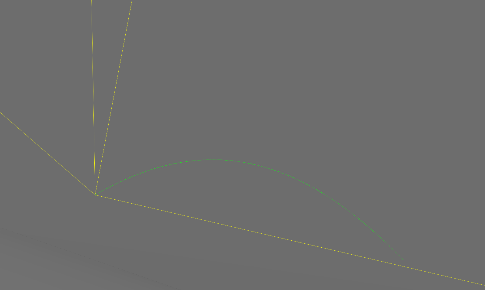

Enabling Gravity
================

.. include:: wipwarning.rst

A global gravity field for neutrons can be enabled using the G4GravityHelper
module in the framework by adding two lines in your main python script (the
"sim-script"):

.. code-block:: python

  #launcher is the G4Launcher object used in the sim-script
  import G4GravityHelper.NeutronGravity as ng
  ng.enableNeutronGravity(launcher)

This enables a standard strength (:math:`9.80665m/s^2`) gravity field, pointing
along the direction :math:`(x,y,z) = (0,-1,0)`. This follows the convention that
the y-axis points upwards. Note that for performance reasons, only neutrons will
be affected by this field.

To change the direction of the gravity field, specify the direction (should form
a unit vector!) in the call. For instance, if in your geometry the x-axis should
point upwards, do:

.. code-block:: python

  import G4GravityHelper.NeutronGravity as ng
  ng.enableNeutronGravity(launcher,-1,0,0)

The field strength can be changed with the ``g``-parameter (note that the provided
parameter will be assumed to be in units of :math:`m/s^2`):

.. code-block:: python

  import G4GravityHelper.NeutronGravity as ng
  ng.enableNeutronGravity(launcher,g=9.82)

Or change both direction and strength:

.. code-block:: python

  import G4GravityHelper.NeutronGravity as ng
  ng.enableNeutronGravity(launcher,-1,0,0,g=9.82)

.. rubric:: Example
    :name: EnablingGravityInGeant4-Example

A screenshot of tracking a :math:`10^{-6}` eV ultra-cold neutron in vacuum. The neutron is
ultimately captured by the floor.

