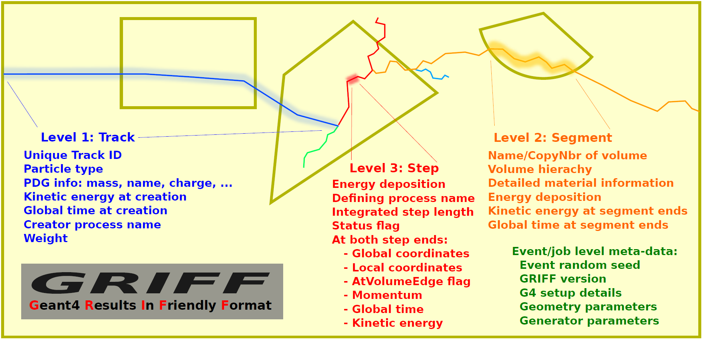
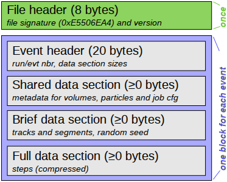

.. _sbgriff:

Griff
=====

A general purpose object oriented output file format, Griff (**G**\ eant4 **R**\
esults **I**\ n **F**\ riendly **F**\ ormat), with meta-data has been
implemented in dgcode, in order to facilitate a faster turn-around
time when setting up and analysing simulations, as well as allowing more complex
and detailed whole-event analyses. Based on custom serialisation code, it is
optimised for easy, fast and reliable analyses from either C++ or Python of
low-multiplicity physics, but supports filtering for scenarios involving higher
multiplicities or statistics. No dedicated publication for Griff exists at this
point in time, but it was presented in `doi:10.1088/1742-6596/513/2/022017
<http://dx.doi.org/10.1088/1742-6596/513/2/022017>`__ which should so far be
used as the main reference.

Data contents
-------------

Installed through the Geant4 stepping action hook, entire simulated events will
by default be written to the file, including information normally available to
traditional Geant4 in-job analyses -- such as information about volumes and
particle meta data. The file can thus be opened and read without a Geant4
installation, and provides the user with an object oriented access to
information from the entire event as illustrated in the first figure on the top
right of this page. Easy navigation between objects (e.g. from a track to its
daughter tracks or constituent steps) is naturally included. As illustrated in
the figure, one additional layer is interspersed between the track and step
layers: series of consecutive steps of a track within a given volume are grouped
together in *segments*. Not only does this facilitate a more efficient data
layout, it is also a highly useful concept at the analysis level.

A more detailed view of what data is available in a Griff file can be gained by
looking at the C++ classes in the :sbpkg:`GriffDataRead` package:

* Event level:
  :sbpkg:`GriffDataReader <GriffDataRead/libinc/GriffDataReader.hh>`
* Object data:
  :sbpkg:`Track<GriffDataRead/libinc/Track.hh>`,
  :sbpkg:`Segment<GriffDataRead/libinc/Segment.hh>`,
  :sbpkg:`Step<GriffDataRead/libinc/Step.hh>`
* Object-level metadata:
  :sbpkg:`Material<GriffDataRead/libinc/Material.hh>`,
  :sbpkg:`Element<GriffDataRead/libinc/Element.hh>`,
  :sbpkg:`Isotope<GriffDataRead/libinc/Isotope.hh>`,
  :sbpkg:`Touchable<GriffDataRead/libinc/Touchable.hh>`
* Job-level metadata:
  :sbpkg:`Setup<GriffDataRead/libinc/Setup.hh>`
* Convenience functions:
  :sbpkg:`DumpObj<GriffDataRead/libinc/DumpObj.hh>`

Data reduction / output filtering
---------------------------------

If necessary, Griff supports two non-exclusive means of reducing data size by
filtering output (note that this is not to be confused with the selection
filtering performed during analysis of Griff files, described in a section
further down this page):

* **Reduce step data globally:** Due to the contained coordinates, step data
  requires the most disk space; therefore, the primary global filtering method
  is to reduce the amount of steps written out. Either by completely
  omitting step data, or by combining all steps on a segment into one
  meta-step. Conveniently controlled by a global flag, there are thus three
  available modes:

  * **FULL**: All steps are written to the file. Naturally this provides full
    information at the expense of creating the largest files.
  * **MINIMAL**: No steps are written to the file. This creates very
    light-weight files, and is useful when an analysis do not need coordinates
    or momenta of particles.
  * **REDUCED**: All steps on each segment are coalesced into a single
    step. Keeping the coordinates and momenta at the ends of each segment, this
    mode often represents the best compromise between size and information.

* **Custom output filters:** Alternatively, users can register custom
  step-filters, thereby gaining complete control of the stored output. Step
  filters implement
  :sbpkg:`StepFilterBase<G4Interfaces/libinc/StepFilterBase.hh>` and essentially
  filters each G4Step instance during Geant4 simulation. The potential gain in
  file-size from this are huge, but the downside is obviously that the whole
  event is no longer available (i.e. when analysing, one can't be certain that a
  track has all of its segments, steps or daughter tracks available). They can
  be activated from either Python or C++. A few premade examples of such filters
  reside in the :sbpkg:`G4CollectFilters` package, but users are free to
  implement their own:

  * :sbpkg:`StepFilterPrimary<G4CollectFilters/libinc/StepFilterPrimary.hh>` : Only write out the steps of primary particles.
  * :sbpkg:`StepFilterVolume<G4CollectFilters/libinc/StepFilterVolume.hh>` : Only write out the steps in certain volumes.
  * :sbpkg:`StepFilterTime<G4CollectFilters/libinc/StepFilterTime.hh>` : Only write out the steps happening at certain times.

  To actually use the filters, they must be enabled in a :ref:`sim-script
  <sbsimscript>` (see :sbpkg:`here<G4Examples/scripts/simwithgrifffilter>` for a
  complete example of such a script):

  .. code-block:: python

    import G4CollectFilters.StepFilterVolume
    #...
    my_griff_filter = G4CollectFilters.StepFilterVolume.create()
    my_griff_filter.volumeList = ["Detector"]
    #...
    launcher.setFilter(my_griff_filter)#Griff filter
    #...

How to enable Griff output
--------------------------

When using dgcode, the default is that Griff output is enabled and in **FULL**
Griff mode, written to a file named ``output.griff``. Most :ref:`sim-scripts
<sbsimscript>` should change these defaults to something reasonable for the
project, which can be done with a call:

.. code-block:: python

  launcher.setOutput("mystuff","REDUCED")

Which changes the default to be to write Griff output in **REDUCED** mode to a
file named ``mystuff.griff``. In case the simulation is run with multiple
processes (using the ``-jN`` flag of the :ref:`sim-script <sbsimscript>`), the
output files will be named ``mystuff.<i>.griff`` where ``<i>`` is a number from
:math:`0` to :math:`N-1`.

No matter what default Griff filename and mode is specified in the
:ref:`sim-script <sbsimscript>`, it is always changeable from the command line
using the ``-o`` and ``-m`` flags:

.. code-block:: sh

  -o FN, --output=FN    Filename for GRIFF output [default mystuff]
  -m MODE, --mode=MODE  GRIFF storage mode [default REDUCED]

Use ``launcher.setOutput("none")`` in the script or ``-o none`` (or
``--output=none``) on the command-line to disable Griff output entirely.

If for some reason you are *not* using the standard :sbpkg:`G4Launcher`-based
:ref:`sim-scripts <sbsimscript>`, you can enable Griff output with the following
C++ call (after including the
:sbpkg:`G4DataCollect/G4DataCollect.hh<G4DataCollect/libinc/G4DataCollect.hh>`
header file from the :sbpkg:`G4DataCollect` package):

.. code-block:: python

  G4DataCollect::installHooks("mystuff","REDUCED")

You will probably also want to call different functions from that header file,
for instance in case you want to store job-level metadata.

Analysing Griff files
---------------------

Basic approach
^^^^^^^^^^^^^^

One simply instantiates a
:sbpkg:`GriffDataReader<GriffDataRead/libinc/GriffDataReader.hh>` object from
the :sbpkg:`GriffDataRead` package and use it both for extraction of job-level
meta-data and for looping through the events while accessing the data (see
above) inside each event, starting from the
:sbpkg:`tracks<GriffDataRead/libinc/Track.hh>` and navigating from these to
other objects.

A simple example of such an analysis is provided in
:sbpkg:`GriffAnaEx/app_testcppana_basic/main.cc`.

.. tip::

   Multiple input files can be chained together by specifying them with a
   wildcard, e.g. ``mysim.*.griff`` (but use quotes ``'`` to avoid the shell
   expanding the ``*`` character for you, so actually type
   ``'mysim.*.griff'``). By default, Griff will abort if the simulation setup in
   all files are not identical, but this behaviour can be changed to instead
   letting the analysis know when a new setup is encountered.

Advanced approach
^^^^^^^^^^^^^^^^^

In addition, some higher-level analysis utilities are available in the
:sbpkg:`GriffAnaUtils` package, which allows (arguably) more readable and
efficient analysis code. The basic idea is that before the loop over events
begins, one declares one or more iterators for
:sbpkg:`tracks<GriffAnaUtils/libinc/TrackIterator.hh>`,
:sbpkg:`segments<GriffAnaUtils/libinc/SegmentIterator.hh>` or
:sbpkg:`steps<GriffAnaUtils/libinc/StepIterator.hh>`, and assigns filters to
them so that during the event loop they can be used to iterate over just the
parts of each event which is of interest.

The :sbpkg:`basic analysis example<GriffAnaEx/app_testcppana_basic/main.cc>`
from the previous section rewritten to use iterators and selection filters is
provided in :sbpkg:`GriffAnaEx/app_testcppana_advanced/main.cc`, and should
illustrate the idea. In addition, a separate example show-casing how one can
implement and use custom selection filters for specific needs is provided in
:sbpkg:`GriffAnaEx/app_customfilter/main.cc`.

For reference, here are the iterators and all presently available filters from
the :sbpkg:`GriffAnaUtils` package (more filters can be added as needed
obviously):

* Iterators:

  * :sbpkg:`TrackIterator<GriffAnaUtils/libinc/TrackIterator.hh>`
  * :sbpkg:`SegmentIterator<GriffAnaUtils/libinc/SegmentIterator.hh>`
  * :sbpkg:`StepIterator<GriffAnaUtils/libinc/StepIterator.hh>`

* Track filters:

  * :sbpkg:`ITrackFilter<GriffAnaUtils/libinc/ITrackFilter.hh>` (base)
  * :sbpkg:`TrackFilter_Primary<GriffAnaUtils/libinc/TrackFilter_Primary.hh>`
  * :sbpkg:`TrackFilter_Charged<GriffAnaUtils/libinc/TrackFilter_Charged.hh>`
  * :sbpkg:`TrackFilter_PDGCode<GriffAnaUtils/libinc/TrackFilter_PDGCode.hh>`
  * :sbpkg:`TrackFilter_Descendant<GriffAnaUtils/libinc/TrackFilter_Descendant.hh>`

* Segment filters:

  *  :sbpkg:`ISegmentFilter<GriffAnaUtils/libinc/ISegmentFilter.hh>` (base)
  *  :sbpkg:`SegmentFilter_Volume<GriffAnaUtils/libinc/SegmentFilter_Volume.hh>`
  *  :sbpkg:`SegmentFilter_EKin<GriffAnaUtils/libinc/SegmentFilter_EKin.hh>`
  *  :sbpkg:`SegmentFilter_EnergyDeposition<GriffAnaUtils/libinc/SegmentFilter_EnergyDeposition.hh>`
  *  :sbpkg:`SegmentFilter_Time<GriffAnaUtils/libinc/SegmentFilter_Time.hh>`

* Step filters:

  *  :sbpkg:`IStepFilter<GriffAnaUtils/libinc/IStepFilter.hh>` (base)
  *  :sbpkg:`StepFilter_EKin<GriffAnaUtils/libinc/StepFilter_EKin.hh>`
  *  :sbpkg:`StepFilter_EnergyDeposition<GriffAnaUtils/libinc/StepFilter_EnergyDeposition.hh>`
  *  :sbpkg:`StepFilter_Time<GriffAnaUtils/libinc/StepFilter_Time.hh>`

Python API
^^^^^^^^^^

For convenience, all the Griff analysis classes are available in Python as well
as in C++. This allows one to write analyses in Python just as (or rather, more)
easily than in C++, as well as doing away with the need of a compilation in the
*edit* → *compile* → *run* analysis cycle typically carried out.

To see how Griff analysis can be performed in Python, here are the "basic" and
"advanced" example from the previous sections as Python scripts:

* :sbpkg:`GriffAnaEx/scripts/testpyana_basic`
* :sbpkg:`GriffAnaEx/scripts/testpyana_advanced`

There is also another advanced example in
:sbpkg:`GriffAnaTests/scripts/testiter_py`.

There is unfortunately one major downside of performing the analysis in Python
rather than in C++, and that is that it can be a lot slower. Mostly, this does
not matter, but when one have loops with a high number of events, then any
difference in speed per event will obviously be noticeable. If using the
"advanced" analysis approach with iterators and selection filters, the act of
accessing the Griff data itself will be almost as fast in Python as in
C++. However, normally the user will then do other stuff inside the loop such as
performing calculations with the extracted data, and those calculations might
unfortunately not be very fast when implemented inside a very long loop in
Python.

The recommendation is thus to use C++ for Griff analysis when computational
speed is a concern, but for smaller statistics (say, millions of particles
simulated), Python remains a great option for quickly putting some plots
together. A typical analysis approach in case of very large statistics would be
to carry out the initial analysis in C++, writing out histograms
(cf. :ref:`SimpleHists <sbsimplehists>`), and then performing further analysis
and plot production in Python, using those histograms (and perhaps also the
job-level metadata from Griff).

Command-line utilities
----------------------

A few command-line utilities are provided:

* ``sb_griffformat_info``: Can be used to quickly inspect the metadata in a
  file. This can be used to answer questions such as "what is in this file"? Or
  "with what settings did I simulate here?".
* ``sb_griffformat_dumpfile``: Can be used to inspect the data inside a file at
  the raw level, and is mainly for experts. One important feature though is
  that it can be used to verify the integrity of the data, in case one is
  suspicious that a file might have become corrupted.
* ``sb_g4osg_viewgriff``: Can be used to visualise the data inside a file with
  our :ref:`custom viewer <sbvisgrifffile>`.
* ``sb_griffanautils_extractevts``: Can be used to select and extract a few
  events from a large griff file into a smaller one. Run with ``--help`` for
  instructions.

Implementation
--------------

Hidden from the user, the actual on-disk layout of Griff files is illustrated in
the figure above: after a short file header, one event block is appended
for each event. Data inside the block is kept in three sections containing
shared, brief and full data respectively. Data unique to individual tracks,
segments and steps is kept in the two latter, while as the name implies, common
data relevant across events is kept in the shared data section. This includes
any strings and metadata relating to volumes, particles, and job configuration,
which can then be referenced economically through simple indices in the other
sections (in current and following events). This means that in order to load the
``N``'th event, the shared data sections of events 1 through ``N`` must have
been loaded. Such a layout was chosen to enable direct streaming to disk without
the need for additional post-processing, but typically only the first few events
in a file will contain shared data. It also allows fast event skipping if search
for specific events, since only the event header will have to be read in most
intermediate events. Finally, it should be noted that segments and steps are
written in an arrangement which prevents the necessity to needless duplicate
information. An example of this is that the post-step position of a given step
will be identical to the pre-step position of the following step, and this
position is thus shared between the two.

The loading of an event is a highly optimised operation: the brief data section
is loaded into memory and wrapped with pre-allocated thin track and segment
classes. Data deserialisation is granular and happens only on demand when a
particular property of an object is queried, and step objects are only created
for a particular segment if needed.

The actual code implementing Griff is spread over several packages:

:sbpkg:`EvtFile` :
  Package implementing the container format with file and event header, section
  blocks (as illustrated in the image above), event skipping, and
  associated disk I/O and compression.

:sbpkg:`GriffFormat` :
  Package with common definitions used by both reader and
  writer modules. Also contains command-line scripts for inspecting Griff files
  (``sb_griffformat_info`` and ``sb_griffformat_dumpfile``).

:sbpkg:`GriffDataRead` :
  Package providing a data reader and related objects
  such as tracks, segments and steps.

:sbpkg:`GriffAnaUtils` :
  Optional package, providing iterators and selection filters for the objects in
  :sbpkg:`GriffDataRead`.

:sbpkg:`G4DataCollect` :
  Geant4 hooks and stepping action for extracting data
  during simulation and creating Griff files.

:sbpkg:`GriffAnaEx` :
  Optional package with a few examples of how to analyse a Griff file.

Note that of the packages listed above, only :sbpkg:`G4DataCollect` actually
depends on Geant4. Thus, analysis of Griff files does not require a Geant4
installation.
