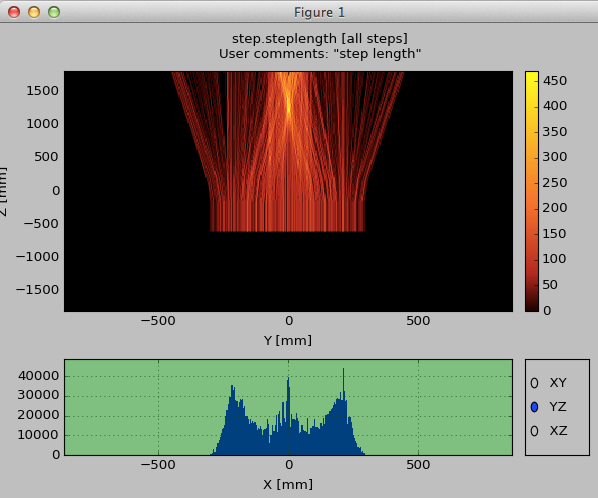

.. _sbheatmap:

Heat Maps
=========

.. include:: wipwarning.rst

.. container::

  |image_heatmapviewer|

"Heat-map" (really 3D histograms) information of any quantity can be easily
extracted from any :ref:`sim-script <sbsimscript>`. Either by adding lines
inside the script itself, or simply by using the ``--heatmap`` command-line flag
when invoking the script. Assuming your simulation project was created as
discussed :ref:`here <sbnewsimproject>` and that it was named ``TriCorder``, the
sim-script will be named ``sb_tricorder_sim`` and you can get help concerning
how to extract a heatmap interactively:

.. include:: ../build/autogen_tricorder_simheatmaphelp.txt
  :literal:

Refer to :ref:`filter expressions <sbmcplfilterexpressions>` for a full list of
available parameters in the ``QUANTITY`` and ``CONDITION`` expressions.

Resulting heatmap files have the extension ``.mesh3d`` and can be inspected
interactively via the ``sb_mesh3d_browse command``, leading to an interactive
display where one can view the 3D data projected onto any cartesian plane and
optionally only using data from selected slices of the third dimension. See the
image above for an example.

For reference, here is a complete example of a command (from the
:sbpkg:`bundleroot::dgcode_val` bundle) which collects a heat map of electromagnetic
energy deposition into a file named ``edep_em.mesh3d``::

  $> sb_skeletonsp_sim -n10000 -j8 --heatmap="step.edep where (trk.pdgcode==11||trk.is_photon) to edep_em"

