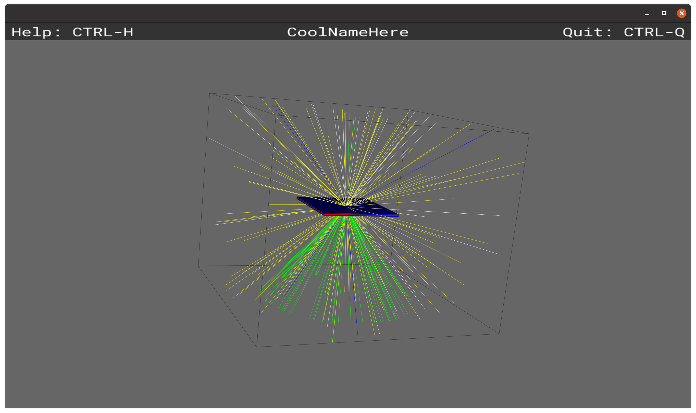
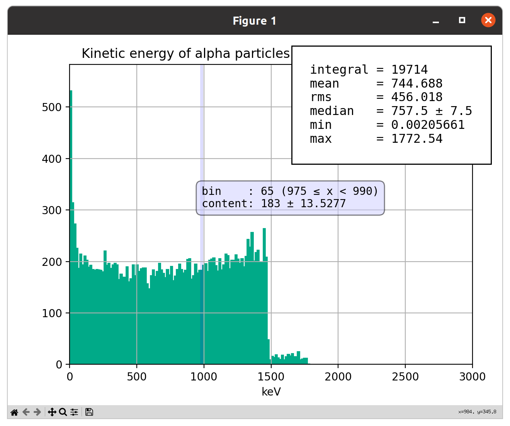
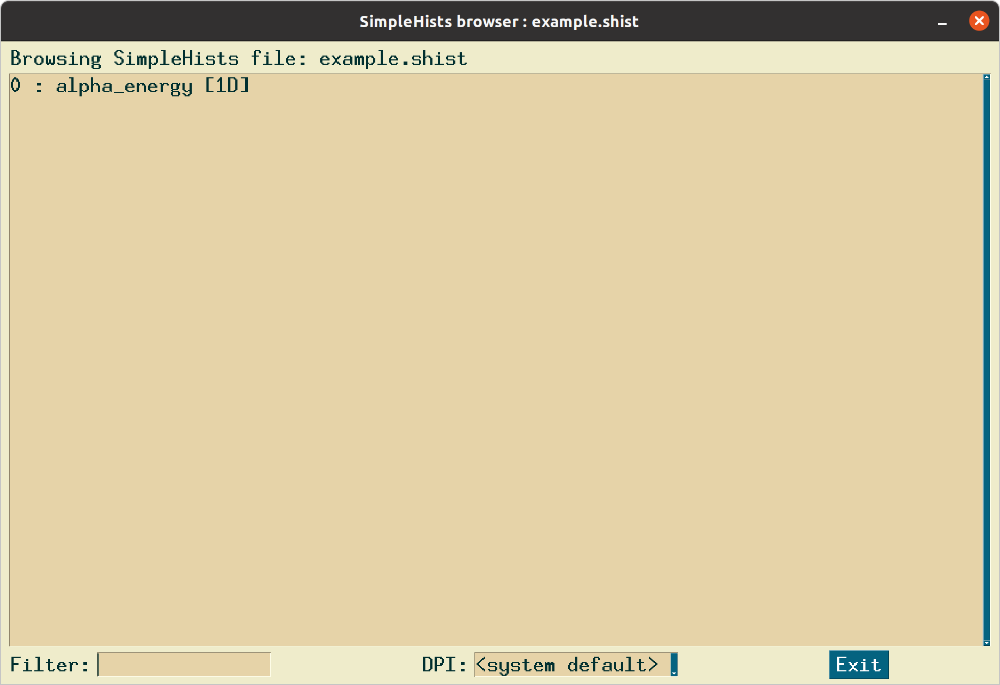

.. _sbinstall:

************
Installation
************

The simplebuild system and dgcode itself is supported only on unix systems
(macOS and Linux), although it most likely will also work on Windows under the
WSL (Windows Subsystem for Linux) with a virtual Ubuntu installation. It is used
exclusively by entering shell commands in a terminal interface, so be sure you
are familiar with such command line interfaces.

Install via conda
=================

..
  Fixme: add conda badges

The recommended and easiest way to install dgcode is by creating an
appropriate conda environment based on the `conda-forge
<https://conda-forge.org/>`__ channel, in which all the dependencies are
included. The package for dgcode itself must still be installed via the PyPI
(pip) package for the time being, although that will change at some point in the
future (cf. `#9
<https://github.com/mctools/simplebuild-dgcode/issues/9>`__). The recommended
conda environment ``.yml`` file to use to create the environment is the
following:

.. include:: ../../resources/conda_dgcode.yml
  :literal:

You can download the above recipe file here: :download:`conda_dgcode.yml
<../../resources/conda_dgcode.yml>`.

To use it, you must first install conda. Instructions for how to do that is
beyond the scope of the present documentation, but in general this can be done
in a variety of ways (installing Miniforge, Miniconda, Anaconda, or even via
Homebrew). If you don't have conda installed already and do not have any other
reason for a preference, we would recommend to use `Miniforge
<https://github.com/conda-forge/miniforge>`__ since it is light-weight and
supposedly has the fewest legal concerns.

After you have conda installed, download :download:`conda_dgcode.yml
<../../resources/conda_dgcode.yml>` and run the command::

  conda env create -f conda_dgcode.yml

Note that since the requested conda environment in this case includes the rather
sizeable Geant4 packages, it might take several minutes for this command to
finish, and the resulting conda environment will consume several gigabytes of
space (the exact number was around 3.8GB in February 2024).

Do not forget that you must activate your newly created environment before using
it for the first time in a given terminal session::

  conda activate dgcode

Alternatives for experts
========================

The conda recipe above is intended to give a self-contained and reproducible
environment with not only dgcode itself, but also any required tools like
`simplebuild
<https://mctools.github.io/simplebuild>`__, a Python interpreter, and
all the necessary build tools. For special advanced use cases, experts might
simply want to add the code itself into an environment where they otherwise have
ensured that all of these third-party tools are already available. In such a
case, one can simply install dgcode via ``pip``, either via a PyPI package
(current version |pypistatus_simplebuilddgcode|_)::

  python3 -mpip install simple-build-dgcode

Or, directly from the latest dgcode sources at GitHub::

  python3 -mpip install git+https://github.com/mctools/simplebuild-dgcode

With this latter approach, one can even install a specific commit id, branch, or
tag by appending ``@<gitid>`` to the URL in the last command. For instance::

  python3 -mpip install git+https://github.com/mctools/simplebuild-dgcode@some_experimental_branch

.. |pypistatus_simplebuilddgcode| image:: https://img.shields.io/pypi/v/simple-build-dgcode.svg
.. _pypistatus_simplebuilddgcode: https://pypi.org/project/simple-build-dgcode

Verifying an installation
=========================

As a verification of a dgcode installation, one can create a dgcode-based
simplebuild project and launch the unit tests from the
:sbpkg:`bundleroot::dgcode_val` bundle (you can remove the leftover ``sbverify``
directory afterwards):

.. literalinclude:: ../build/autogen_sbverify_cmdout_snipped.txt

The important thing to notice here is that unit tests were launched, and the
message ``All tests completed without failures!`` tells us that they all
completed without problems. The ``--requirepkg=DGCodeRecommended`` argument,
ensures that all the most important third party software, like Geant4, NCrystal,
and Matplotlib, is also available on the system. If installing on a cluster
where you do not need any plotting or visualisation tools, you can use
``DGCodeRecommendedNoGUI`` instead.

The unit tests above have one draw-back, in that they do mostly not test
visualisation capabilities. So it is a good idea to manually test the
:ref:`Geant4 data and geometry viewer <sb3dvis>` by launching the command::

  $> sb_g4launcher_example --dataviewer -n1000

Which should give a view like the following (use the mouse to rotate the view):

|image_example_dataviewer|

In the image above, 4.4Å neutrons (green) hit a slab of aluminium from
above. The most prominent features in the image should be yellow lines going out
from the center into all directions, as well as green lines forming a cone. This
is because the scattering physics in the aluminium in this example is provided
by NCrystal as ``stdlib::Al_sg225.ncmat;comp=bragg`` (i.e. only Bragg
diffraction is enabled), so all (singly) scattered neutrons (green) should end
up in a single Debye-Scherrer cone. Other particles like gammas (yellow) are
generated in absorption events, based on Geant4's own built-in physics.

It might also be a good idea to verify that the Matplotlib-based
:ref:`SimpleHists <sbsimplehists>` plotting works, which can be done with the
command::

  $> sb_simplehists_browse -p G4CustomPyGen/example.shist

This should yield an interactive plot of the histogram found in the file (notice
how hovering over a given bin creates a little light-blue transparent popup-box
with detailed information about the bin):

|image_shist_example|

You can also run the same command without ``-p`` to test that the SimpleHists
browser works::

  $> sb_simplehists_browse G4CustomPyGen/example.shist

Which should launch an interactive browser looking like:

|image_shist_browser|

There is only 1 histogram inside this particular file, so the browser is not
particular useful in this case. But you can still test that it works by
confirming that clicking on the histogram results in that histogram being shown.

