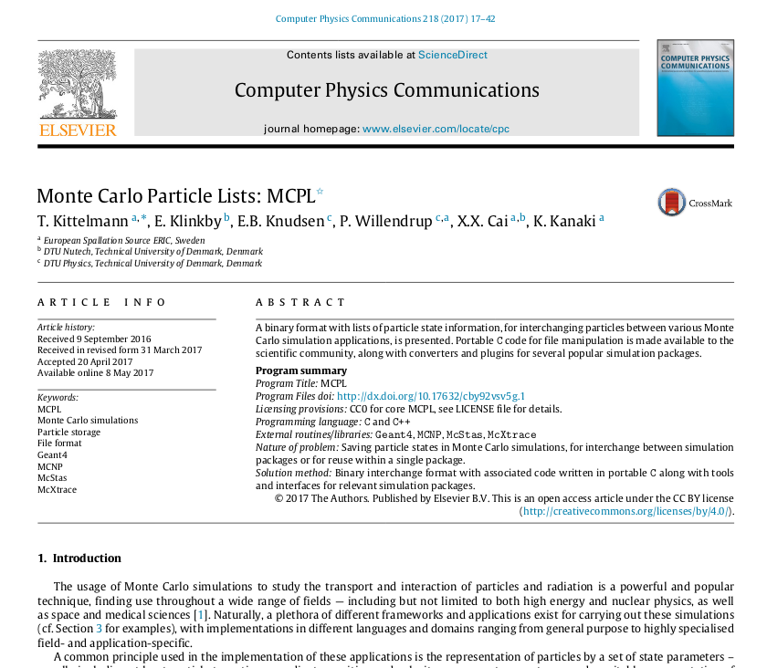
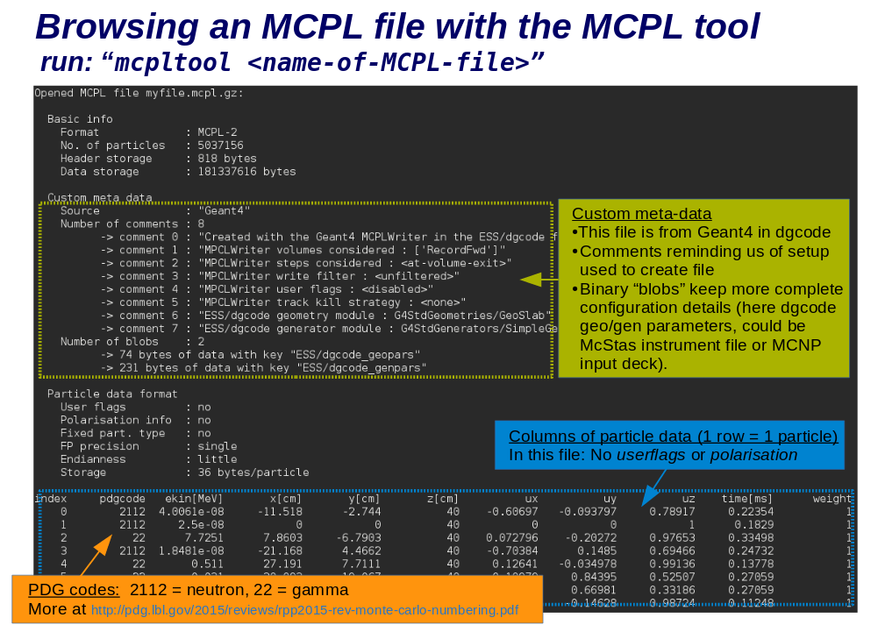
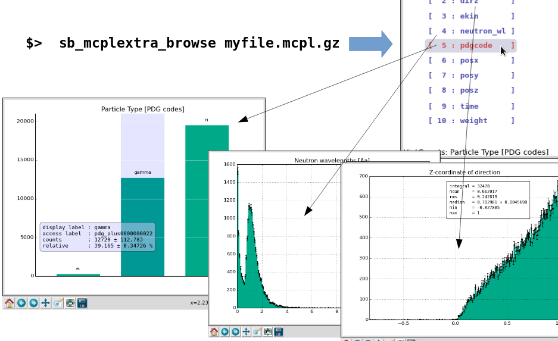

.. _sbmcpl:

MCPL
====

.. include:: wipwarning.rst

FIXME: Mention pymcpltool? And update this entire page. Also include
the following output in the discussion:

.. literalinclude:: ../build/autogen_tricorder_simmcplhelp.txt

FIXME: next two images should be links:

|image1| \ |image2|

MCPL (**M**\ onte **C**\ arlo **P**\ article **L**\ ists) files contain lists of
particle state information, and allows for easy storage and interchange of
particles between various Monte Carlo simulation applications. It is described
in great detail in a `published paper
<https://doi.org/10.1016/j.cpc.2017.04.012>`__ and recipes for how to use with
MCNP and McStas can be found on the `MCPL website
<https://mctools.github.io/mcpl/>`__. Rather than being comprehensive, the
present page will focus on MCPL tools and recipes that are most likely to be of
interest for users simplebuild-dgcode. There is also some information in the
`MCPL talk given at the DG jamboree September 2016
<https://indico.esss.lu.se/event/617/>`__.

.. rubric:: Inspect contents of MCPL files

* Run ``"sb_mcpl_tool myfile.mcpl.gz``\ ``"`` to print contents of files,
  including both file-level meta-data and the particle data itself. It can also
  be used to merge or repair files, or perform simple data extraction. Run
  ``sb_mcpl_tool --help`` for more instructions.  |image3|

* Use ``"sb_mcpl_pytool --stats myfile.mcpl.gz``" to get printed a quick summary
  of the particle contents of a file.

* Use ``"sb_mcplextra_browse myfile.mcpl.gz``" to view a standard set of
  histograms of the content of the file (using to the :ref:`SimpleHists
  <sbsimplehists>` browser).\ |image4|

* You can also add a filter expression (:ref:`see below
  <sbmcplfilterexpressions>`) and only get certain particles collected in your
  histograms. Example: ``sb_mcplextra_browse myfile.mcpl.gz where "is_neutron &&
  ekin>1keV"``". Run "``sb_mcplextra_browse --help``" for more instructions.

* If you need to, you can create custom C/C++ or Python code which opens an MCPL
  file and loops over the particles inside. You can find examples at the MCPL
  website `here <https://mctools.github.io/mcpl/usage_c/>`__ and `here
  <https://mctools.github.io/mcpl/usage_python/>`__, but note that inside dgcode
  you have to observe a few exceptions/rules with respect to the instructions at
  the MCPL website: You will have to add ``"MCPL"`` to your package dependencies
  in your ``pkg.info`` file, and in C/C++ the include statement for ``mcpl.h``
  should be: ``#include "MCPL/mcpl.h"``, while in Python the import statement
  should look like "``import MCPL``".

.. rubric:: Use MCPL files as input to Geant4 simulations
    :name: MCPL-UseMCPLfilesasinputtoGeant4simulations

As documented in more detail :ref:`here <sbparticlegen>`, MCPL files are easily used as input to your Geant4 simulation by using the ``G4MCPLPlugins.MCPLGen`` module in your sim script:

.. container:: code panel pdl

    .. container:: codeContent panelContent pdl

      .. code-block:: python

          import G4MCPLPlugins.MCPLGen as Gen
          gen = Gen.create()
          gen.input_file = "mydata.mcpl.gz"

See :ref:`the dedicated documentation <sbparticlegen>` for more parameters.

.. rubric:: Write MCPL files as output of Geant4 simulations
    :name: MCPL-WriteMCPLfilesasoutputofGeant4simulations

Normally this requires no code changes. Simply use ``the --mcpl`` flag to your sim script to capture all particles entering volumes with a certain name and write them into a newly created MCPL file. So if you have a volume called ``"FwdDet"`` and you wish to capture all particles reaching it into a newly created MCPL file, simply run your sim script like:

.. container:: code panel pdl

    .. container:: codeContent panelContent pdl

      .. code-block:: sh

          sb_mystuff_sim [other options] --mcpl=FwdDet

A more advanced example, capturing any high energy gamma entering any volume
called either ``"Detector"`` or ``"Sample"`` (see more about :ref:`filter
expressions <sbmcplfilterexpressions>` further down on this page):

.. container:: code panel pdl

    .. container:: codeContent panelContent pdl

      .. code-block:: sh

          sb_mystuff_sim [other options] --mcpl="Detector,Sample where trk.pdgcode==22 and step.pre.ekin > 1MeV"

There are many other configuration possibilities, including attaching custom per-particle info to the stored particles ("user flags"). Run with ``--mcpl=help`` for complete instructions.

Finally, it is of course also possible to configure MCPL writing using Python
code inside your sim script, rather than using command-line options, by using
the ``G4MCPLPlugins.MCPLWriter`` module. See an example :sbpkg:`here
<G4MCPLTests/scripts/mcplwrite>` for how to use it.

.. rubric:: Write MCPL files as output of McStas instrument simulations
    :name: MCPL-WriteMCPLfilesasoutputofMcStasinstrumentsimulations

If you for instance need to get neutrons from a McStas simulation of an ESS
instrument and into your Geant4 simulation of a detector, all you have to do is
usually to ask your instrument scientist (or whoever it is running the McStas
simulation of the instrument) to add 2 lines to their instrument file (usually
just before or after the sample component) and rerun. Find more information at
https://mctools.github.io/mcpl/hooks_mcstas/.

.. rubric:: Modify MCPL files
    :name: MCPL-ModifyMCPLfiles

The ``sb_mcplextra_filterview`` command can be used to produce new MCPL file
from an existing one, with a subset of the original particles. The following
example shows how to extract just neutrons with long wavelength (see :ref:`below
<sbmcplfilterexpressions>` for more info on filter expressions):

.. container:: code panel pdl

    .. container:: codeContent panelContent pdl

      .. code-block:: sh

          sb_mcplextra_filterfile infile.mcpl outfile.mcpl "is_neutron && neutron_wl > 0.5Aa"

And here is an example extracting all particles starting within 1cm of the Z-axis:

.. container:: code panel pdl

    .. container:: codeContent panelContent pdl

      .. code-block:: sh

          sb_mcplextra_filterfile infile.mcpl outfile.mcpl "sqrt(x^2+y^2)<1cm"

Or, getting the first 1000 particles from a file (perhaps to get a smaller file which can be more easily shared for debugging purposes):

.. code-block:: sh

  sb_mcplextra_filterfile infile.mcpl outfile.mcpl -l1000

Run ``sb_mcplextra_filterfile --help`` for full usage instructions.

.. _sbmcplfilterexpressions:

.. rubric:: Reference info: Filter expressions

Several of the commands or Python modules above accepts flexible filter
expressions. This functionality is implemented via the custom
:sbpkg:`ExprParser` package inside dgcode, and which variables one can use
depends on the context.

-  Always available:

  - Mathematical functions (``sin``, ``exp``, ``acos``, etc.). See full list in
    :sbpkg:`ASTStdMath.cc<ExprParser/libsrc/ASTStdMath.cc>` (look in the
    ``create_std_math_function`` function).
  - Physics units (``mm``, ``cm``, ``keV``, ``MeV``, etc.). See the full list in
    :sbpkg:`Units/libinc/Units.hh` or :sbpkg:`the equivalent Python
    file<Units/python/__init__.py>`.
  - Mathematical and physics constants (``pi``, ``c_light``, ``h_Planck``,
    etc.). Again, see the full list in
    :sbpkg:`Units/libinc/Units.hh` or :sbpkg:`the equivalent Python
    file<Units/python/__init__.py>`.

-  Available when filtering based on content of MCPL files (i.e. when using MCPL file as input):

  -  Position: ``x``, ``y``, ``z`` (aliases: ``posx``, ``posy``, ``posz``)
  -  Direction: ``ux``, ``uy``, ``uz`` (aliases: ``dirx``, ``diry``, ``dirz``)
  -  Particle type, as PDG code (2112=neutron, 22=gamma, etc.): ``pdgcode``

    -  For convenience, the following derived boolean variables are provided: ``is_neutron``, ``is_gamma`` (alias ``is_photon``), ``is_neutrino``, ``is_ion``

  -  Kinetic energy: ``ekin``

    -  For convenience, the following derived variable is provided for neutrons, to make it easy to filter on the wavelength: neutron_wl. Note that this variable is only defined for neutrons, so it should be protected in expressions with ``is_neutron``, i.e. ``"is_neutron && neutron_wl>1Aa``".

  -  Polarisation: ``polx``, ``poly``, ``polz``
  -  Time stamp: ``time``
  -  Weight/intensity: ``weight``
  -  MCPL userflag value, as integer: ``userflag``

-  Available when filtering on Geant4 simulations in progress (i.e. when writing MCPL files from Geant4 simulations):

  -  G4Track-level parameters (refer to Geant4 documentation for details): ``trk.trkid``, ``trk.parentid``, ``trk.is_primary``, ``trk.is_secondary``, ``trk.creatorprocess``, ``trk.weight``, ``trk.mass``, ``trk.width``, ``trk.charge``, ``trk.lifetime``, ``trk.name``, ``trk.type``, ``trk.subtype``, ``trk.atomicnumber``, ``trk.atomicmass``, ``trk.magneticmoment``, ``trk.spin``, ``trk.is_stable``, ``trk.is_shortlived``, ``trk.pdgcode``, ``trk.is_neutron``, ``trk.is_neutrino``, ``trk.is_opticalphoton``, ``trk.is_photon`` (optical or standard photon), ``trk.is_gamma`` (same as ``trk.is_photon``), ``trk.is_ion`` and ``trk.mcplflag`` (the MCPL userflag from the input file, in case the G4 event is generated from an MCPL file).
  -  G4Step-level parameters (again, refer to Geant4 documentation for details): ``step.edep``, ``step.edep_nonion``, ``step.edep_ion``, ``step.delta_e``, ``step.delta_mom``, ``step.delta_pos``, ``step.delta_time``, ``step.steplength``, ``step.stepnbr``, ``step.volname``, ``step.volname_1`` (name of mother volume), ``step.volname_2`` (name of grandmother volume), ``step.volcopyno``, ``step.volcopyno_1`` (copy number of mother volume), ``step.volcopyno_2`` (copy number of grandmother volume), ``step.mat_name``, ``step.mat_state``, ``step.mat_density``, ``step.mat_temperature``, ``step.mat_pressure``, ``step.process_defined_step``.
  -  G4StepPoint-level parameters (again, refer to Geant4 documentation for details). Must be accessed either as post-step or pre-step, i.e. ``step.pre.time`` or ``step.post.time``. Here they are just listed in the ``step.pre.xxx`` form: ``step.pre.stepstatus``, ``step.pre.time``, ``step.pre.globaltime``, ``step.pre.localtime``, ``step.pre.propertime``, ``step.pre.mat_name``, ``step.pre.mat_state``, ``step.pre.mat_density``, ``step.pre.mat_temperature``, ``step.pre.mat_pressure``, ``step.pre.ekin``, ``step.pre.neutron_wl``, ``step.pre.etot``, ``step.pre.velocity``, ``step.pre.beta``, ``step.pre.gamma``, ``step.pre.at_voledge``, ``step.pre.x``, ``step.pre.y``, ``step.pre.z``, ``step.pre.px``, ``step.pre.py``, ``step.pre.pz``, ``step.pre.polx``, ``step.pre.poly``, ``step.pre.polz``, ``step.pre.mom``, ``step.pre.mom2``, ``step.pre.weight``, ``step.pre.process_defined_step``, ``step.pre.volname``, ``step.pre.volname_1``, ``step.pre.volname_2``, ``step.pre.volcopyno``, ``step.pre.volcopyno_1``, ``step.pre.volcopyno_2``, ``step.pre.local_x``, ``step.pre.local_y``, ``step.pre.local_z`` and ``step.pre.exists`` (boolean flag, false if the step-point info is not available - i.e. if ``step.post.exists`` is false, one should not access other ``step.post.xxx`` variables - this is usually only a concern for the post-step).

