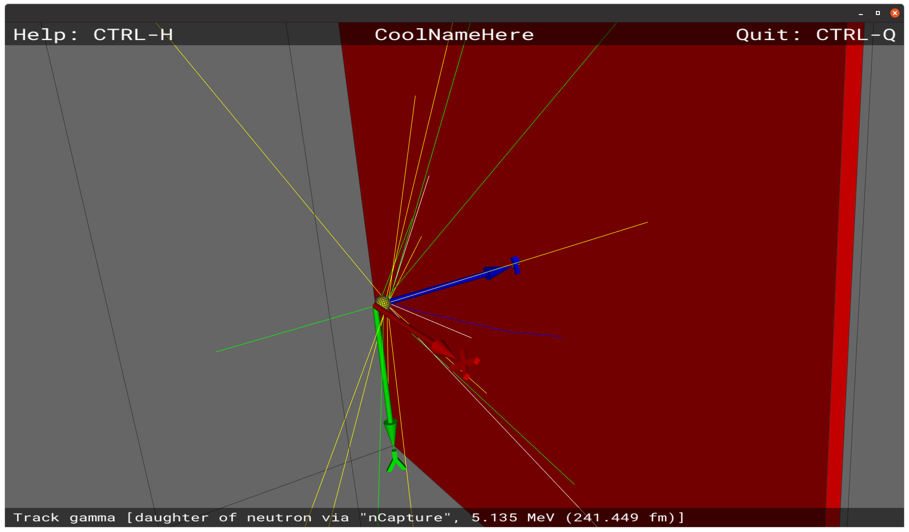

.. _sbnewsimproject:

*********************************
Starting a new simulation project
*********************************

It can admittedly be a bit daunting for new users to get started on implementing
their own simulation project. For that reason, we have created a little helpful
(hopefully) utility, which based on a user-supplied project name helps the users
setting up all the necessary files and directories required to add a few
simplebuild packages containing a little trivial example of how to setup and
analyse a Geant4 simulation. The user can then get started quickly, simply by
modifying the example.

The command to use is ``dgcode_newsimproject``:

.. include:: ../build/autogen_tricorder_newsimproj_help.txt
  :literal:

For the sake of the following discussions, we will assume you are creating a
completely fresh working directory in which you wish to work (this might of
course not be the case). Thus, create a new empty directory, step into it and
use ``sb --init dgcode`` to setup a new simplebuild+dgcode project, and then
build everything afterwards with ``sb`` (that might take a few minutes):

.. include:: ../build/autogen_tricorder_sbinit_plus_snippet_sb.txt
  :literal:

So assuming we want a project to investigate the properties of a new amazing
detector technology, named "tricorder", we then proceed by using the
``dgcode_newsimproject`` command (please try to use `CamelCasing
<https://en.wikipedia.org/wiki/Camel_case>`__ for project names):

.. include:: ../build/autogen_tricorder_newsimproj_TriCorder.txt
  :literal:

As written, new packages and files have been created for you in your local
directory (defaulting to the directory of your master ``simplebuild.cfg``
file). Of course, if you are working with code in a shared repository (e.g. at
GitHub), nothing has been added to the remote repository at this point. Nor
should it, since having multiple essentially identical copies of the same
example in a shared repository is not very useful. Rather, you are now expected
to modify the files as appropriate for your actual project before finally ``git
add``'ing and committing and pushing them to the central repository server. If
these terms are obscure to you, you should most likely spend some time learning
about Git, for instance `here <https://en.wikipedia.org/wiki/Git>`__ or `here
<https://git-scm.com/book/en/v2>`__.

For now, you can immediately type ``sb`` to ensure that the newly added files
get built, or even ``sb --tests`` to also run the associated unit tests:

.. include:: ../build/autogen_tricorder_newsimproj_sbtests.txt
  :literal:

Editing the generated files
===========================

The pre-filled example inside the files consists of a simple setup in which
neutrons hit a spherical sample and get recorded on a box-shaped detector.
Running the simulation and analysis with default values will result in
histograms (in a :ref:`SimpleHists <sbsimplehists>` file) representing the
"detected" hitmap, in which Debye-Scherrer cones from the polycrystalline sample
material can be observed. It might be useful to start by :ref:`visualising
<sb3dvis>` the simulation setup with the command ``sb_tricorder_sim --dataviewer
-n100`` (or ``sb_tricorder_sim --viewer`` to get just the geometry):

|

The most interesting files in our TriCorder project, and the files you
especially need to focus on when editing, are discussed in the following. Note
that for technical reasons the links below points to files in a project called
"SkeletonSP" instead of "TriCorder", but apart from the naming there is no
difference:

:sbpkg:`TriCorder/G4GeoTriCorder/pycpp_GeoTriCorder/geometry_module.cc<G4GeoSkeletonSP/pycpp_GeoSkeletonSP/geometry_module.cc>`:
   The implementation of the simulation geometry, including definition of
   modifiable parameters.

:sbpkg:`TriCorder/TriCorder/scripts/sim<SkeletonSP/scripts/sim>`:
   The simulation script which puts together our geometry with a generator and
   becomes the command ``sb_tricorder_sim``, which can be used to launch the
   simulation, or visualise it. Run the command ``sb_tricorder_sim -h`` to learn
   more about the possibilities. The output of the simulation is one or more
   :ref:`Griff <sbgriff>` files. In the :sbpkg:`same 'scripts'
   directory<SkeletonSP/scripts>` you will also find more specialised scripts,
   which can be used to for instance create :ref:`parameter scans <sbparamscan>`.

:sbpkg:`TriCorder/TriCorder/app_ana/analysis_program.cc<SkeletonSP/app_ana/analysis_program.cc>`:
   An analysis program which can be invoked via the command ``sb_tricorder_ana``
   and which is used to run on the :ref:`Griff <sbgriff>` files and which will
   result in a :ref:`SimpleHists <sbsimplehists>` file being created with
   analysis histograms. It can be opened for additional analysis, or simply
   browsed with the ``sb_simplehists_browse`` command.

:sbpkg:`TriCorder/TriCorder/pkg.info<SkeletonSP/pkg.info>` and :sbpkg:`TriCorder/G4GeoTriCorder/pkg.info<G4GeoSkeletonSP/pkg.info>` :
   The ``pkg.info`` files should contain a bit of general information about what
   your simulation project is about, which people are involved with it,
   etc.

Of course, you should only git commit some or all of these files once you have
actually edited them somewhat as suits your project. After all, you are most
likely not interested in filling up your project's repository filled up with 10
versions of the same simple example, only differing in their names.

