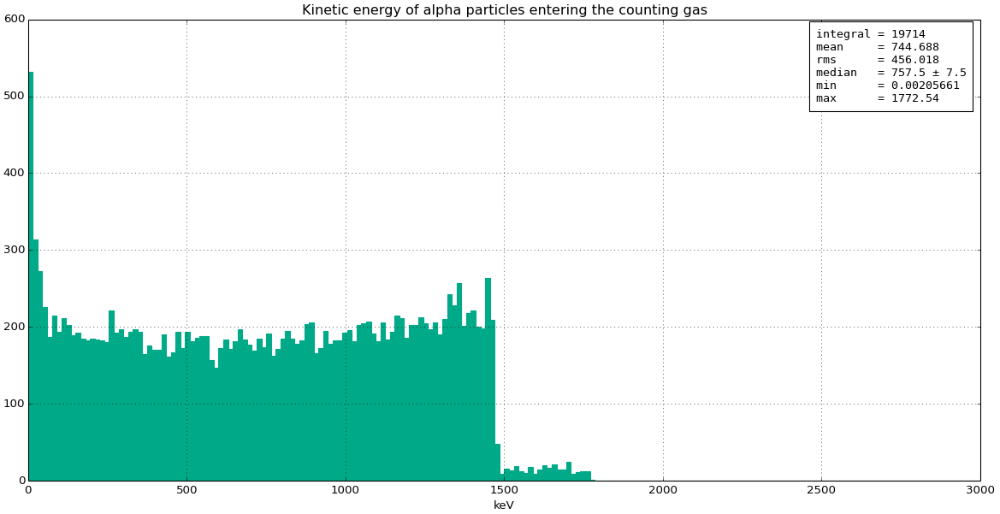

Particle generators for Geant
******************************

.. include:: wipwarning.rst

As important for a Geant4 simulation as geometry, materials and physics list, is
the initial set of particles to be "let loose" in the simulation each event:
these source particles are called *primary* particles in Geant4 terminology, and
any particle generated indirectly as a result of the simulation of the
interactions between particles and the material of the simulation geometry are
accordingly denoted *secondary* particles.

Whenever creating a new primary particle, a generator module must fully define
its initial state, which typically means choosing:

-  Particle type (neutron, gamma, e-, ...)
-  Kinetic energy (or wavelength)
-  Position (must be within the *world volume* of the simulation geometry)
-  Direction

Other parameters which can be set, but often are not, are:

-  Weight (normally only different from 1 when some clever setup involving event biasing is contemplated)
-  Polarisation (when not mentioned, it normally means that the particle is generated unpolarised)
-  Time (when not mentioned, it normally means that the particle is generated at t=0)

In dgcode, generators are implemented as separate specialised modules with
configurable parameters in the same manner as geometry modules are. The main
differences are firstly that generator modules are very often reusable across
many specific projects or studies, while this is more rarely seen for geometry
modules. Secondly, as we shall see below, generator modules can be implemented
purely in just a few lines python if desired.

.. rubric:: How to select and configure a generator module in a given simulation script

Picking a generator module in a simulation script is done in the same manner as
picking a geometry module: One imports the desired generator module,
instantiates a given generator instance (called "gen" below), and optionally
changes the default value of one or more of the parameters available for the
given generator module. Of course, those values can again be overwritten from
the command line should the user of the simulation script so desire). In the
example below, the author of the simulation script in question has decided to
use the SimpleGen generator module from the :sbpkg:`G4StdGenerators` package:

.. code-block:: python

  #!/usr/bin/env python

  import G4GeoTriCorder.GeoTriCorder as geomodule
  geo = geomodule.create()

  import G4StdGenerators.SimpleGen as genmodule
  gen = genmodule.create()
  gen.particleName = 'neutron'
  gen.neutron_wavelength_aangstrom = 2.2

  import G4Launcher
  launcher = G4Launcher(geo,gen)
  launcher.go()

If the above script is located in a folder ``TriCorder/scripts/sim`` (i.e. in
the ``scripts/`` sub-dir of a package called TriCorder), it will end up as a
command ``sb_tricorder_sim`` (avid readers of the present wiki might recognise
the TriCorder example from the instructoons for :ref:`creating a new simulation
project <sbnewsimproject>`). One can see the available parameters by running the
command with ``-p`` (if you forget that the flag is ``-p`` you can always run with
``-h`` first for usage instructions):

FIXME dynamic autogen_tricorder_sim_p.txt:

.. code-block::

  $> sb_tricorder_sim -p
  ParticleGenerator[G4StdGenerators/SimpleGen]:
    [dbl] fixed_x_meters = 0
    [dbl] fixed_y_meters = 0
    [dbl] fixed_z_meters = 0
    [dbl] fixed_energy_eV = 0.016901694474302
    [dbl] neutron_wavelength_aangstrom = 2.2
    [dbl] fixed_xdir = 0
    [dbl] fixed_ydir = 0
    [dbl] fixed_zdir = 1
    [str] particleName = "neutron"

To understand what the different parameters are for, one can:

- Read on further down this page where all the generators from the
  :sbpkg:`G4StdGenerators` package are mentioned (or on some other wiki page
  dedicated to the generator module in question).
- Guess based on the hopefully very descriptive names of the parameters
- Supply the ``--dataviewer`` or ``--aimdataviewer`` flag to generate and visualise few
  or many events in a 3D viewer, and see how the tracks are generated in the
  geometry (read more :ref:`here <sb3dvis>`):

   .. image:: images/coolnamehere_aim2.png
      :height: 200px
      :align: center

- Supply the ``--verbose`` flag to generate a few events and print out some info
  about the generated events.
- Locate the source code of the generator module in question and try to
  understand what it does, or ask its author.

.. rubric:: I don't have a geometry or simulation script, I just want to investigate a given generator module

You are in luck! The ``sb_g4utils_querygenerator`` command does just that (in
the same way that the ``sb_g4utils_geodisplay`` can be used to visualise a geometry
module directly)! Get full usage instructions by:

.. code-block::

  $> sb_g4utils_querygenerator -h

Examples of how to select generators and display their parameters (note, in the
example below the ``fixed_y_meters`` parameter was already changed via an
argument):

FIXME dynamic

.. code-block::

  $> sb_g4utils_querygenerator -g G4StdGenerators.SimpleGen fixed_y_meters=0.123
  ParticleGenerator[G4StdGenerators/SimpleGen]:
    [dbl] fixed_x_meters = 0
    [dbl] fixed_y_meters = 0.123
    [dbl] fixed_z_meters = 0
    [dbl] fixed_energy_eV = 100
    [dbl] neutron_wavelength_aangstrom = 0.02860143375001
    [dbl] fixed_xdir = 0
    [dbl] fixed_ydir = 0
    [dbl] fixed_zdir = 1
    [str] particleName = "neutron"

And by adding the ``-v`` and ``-nNEVTS`` flags, one can launch the visualisation
to see some events generated with it in a geometry consisting of an empty world
box volume:

.. code-block::

  $> sb_g4utils_querygenerator -g G4StdGenerators.ProfiledBeamGen -v -n2000 spread_x_mm=500 spread_y_mm=300 spread_mode=FLATCIRCULAR

Leading to the following display (read more about the viewer :ref:`here <sb3dvis>`):

|image2|

.. rubric:: Available generators from the G4StdGenerators package

Three standard generators are provided in the G4StdGenerator package:

- ``SimpleGen``: A very simple generator, producing 1 primary particle each
  event, allowing the user to modify position, direction and energy (or, for
  neutrons, wavelength - but not both wavelength and energy at the same time):

    .. code-block::

      $> sb_g4utils_querygenerator -g G4StdGenerators.SimpleGen
      ParticleGenerator[G4StdGenerators/SimpleGen]:
        [dbl] fixed_x_meters = 0
        [dbl] fixed_y_meters = 0
        [dbl] fixed_z_meters = 0
        [dbl] fixed_energy_eV = 100
        [dbl] neutron_wavelength_aangstrom = 0.02860143375001
        [dbl] fixed_xdir = 0
        [dbl] fixed_ydir = 0
        [dbl] fixed_zdir = 1
        [str] particleName = "neutron"

- ``FlexGen``: The big-brother of ``SimpleGen`` which provides more parameters
  and features. Note that this is a strict super-set of the ``SimpleGen``
  parameters, so migrating code from ``SimpleGen`` to ``FlexGen`` should be as simple as
  renaming ``G4StdGenerators.SimpleGen`` to ``G4StdGenerators.FlexGen`` in the import
  statement. The additional features ``FlexGen`` provides over ``SimpleGen`` are:

    -  Ability to generate particle directions in spherical coordinates.

    - Ability to randomize all variables uniformly over an interval. As an
      example, suppose one would like the y-coordinate of the particles initial
      position to be distributed uniformly between 0.5m and 1.0m, then rather
      than setting the fixed_y_meters variable, one would set:

      .. code-block:: sh

        randomize_y=True random_min_y_meters=0.5 random_max_y_meters=1.0

    - And finally the ability to specify particle identity via `pdg code
      <https://pdg.lbl.gov/2023/reviews/rpp2023-rev-monte-carlo-numbering.pdf>`_
      rather than names, and to generate more than 1 primary particle each
      event.

-  **ProfiledBeamGen**: A generator which generates a beam of particles starting at z=0 and having a given profile in the x-y plane, symmetric around (x,y)=(0,0), unless an offset is given:

.. code-block:: sh

  $> sb_g4utils_querygenerator -g G4StdGenerators.ProfiledBeamGen
  ParticleGenerator[G4StdGenerators/ProfiledBeamGen]:
    [dbl] spread_x_mm = 0
    [dbl] spread_y_mm = 0
    [str] spread_mode = "GAUSSIAN"
    [dbl] offset_x_mm = 0
    [dbl] offset_y_mm = 0
    [dbl] offset_z_mm = 0
    [dbl] energy_eV = 100
    [dbl] neutron_wavelength_aangstrom = 0.02860143375001
    [dbl] neutron_wavelength_spread_aangstrom = 0
    [dbl] neutron_thermal_spectrum_kelvin = 0
    [int] fixed_nparticles = 1
    [flg] randomize_nparticles = no
    [dbl] random_nparticles_poissonmean = 1
    [str] particleName = "neutron"
    [int] pdgCode = 0

-  It shares the options for setting particle type and number with FlexGen, but for energy it provides options for either a Gaussian spread in neutron wavelength, or a perfect thermal distribution.

-  The beam profile is determined by the spread\_... parameters, with spread_x_mm and spread_y_mm giving the dimensions and the spread_mode giving the type of spread, which can be either GAUSSIAN, FLATCIRCULAR or FLATRECTANGULAR (the first giving Gaussian distributions with widths of spread_x_mm and spread_y_mm respectively, while the last two gives uniform rectangular or ellipsoidal distributions within an extent determined by the spread_x_mm  and spread_y_mm).

.. note:: By convention we try to default all generators to shoot particles in the direction of the positive z, starting at z=0 and near (x,y)=(0,0). That way, users will be able to switch generators without completely having to re-orient their geometry, rewrite their analyses, etc. Of course, this is not a strict rule and some-times a different setup makes sense.

.. rubric:: Generators reading external (MCPL) data files

The ``G4MCPLPlugins.MCPLGen`` module allows one to easily inject particles from MCPL files into a Geant4 simulation. The particles in those files can come from a multitude of sources, such as MCNP simulations, McStas simulations, or even other Geant4 simulations. Please find more information for how to create, inspect or modify MCPL files in our wiki at the `MCPL <MCPL.html>`__ page, on the `the official MCPL page at GitHub <https://mctools.github.io/mcpl/>`__, or in the `published MCPL paper <https://mctools.github.io/mcpl/mcpl.pdf>`__. To use it, simply import and use the ``G4MCPLPlugins.MCPLGen`` generator, setting at least the ``input_file`` parameter:

.. code-block:: python

  import G4MCPLPlugins.MCPLGen as Gen
  gen = Gen.create()
  gen.input_file = "mydata.mcpl.gz"

Other optional parameters can be used to translate/rotate the coordinate and directions found in the MCPL file before injecting the particles into your Geant4 coordinate system:

  .. code-block:: python

    gen.dx_meter = 0.1    #translate x coordinates by 10cm
    gen.dy_meter = -0.1   #translate y coordinates by -10cm
    gen.dz_meter = 10     #translate z coordinates by 10m
    gen.rotx_degree = 90  #rotate particle directions 90 degrees around the x axis
    gen.roty_degree = -10 #rotate particle directions -10 degrees around the y axis
    gen.rotz_degree = 180 #rotate particle directions 180 degrees around the x axis

Finally, the ``input_filter`` parameter can be used to select just some of the particles in the file, by providing a logical expression like in the following examples (more info about how to construct such filter expressions can be found at the `MCPL <MCPL.html>`__ page):

.. code-block:: python

  gen.input_filter = "ekin > 2.0MeV && pdgcode == 22"           #high energy photons only
  gen.input_filter = "is_neutron && neutron_wl > 0.5Aa"         #low energy neutrons only
  gen.input_filter = "is_neutron || (is_photon && ekin > 1MeV)" #only neutrons or high energy photons

.. rubric:: Easily implementing a custom generator in python

Wouldn't it be nice if instead of relying on generators written by other people, you could add a few lines of python in your simulation script to put exactly the particles you want exactly where you want them? Well, once again you're in luck!

It is actually this easy (note that the generator can still have parameters configurable from the command line):

.. code-block:: python

  #!/usr/bin/env python

  import G4CustomPyGen
  import Core.Units as Units

  class MyPyGen(G4CustomPyGen.GenBase):

  def declare_parameters(self):
      self.addParameterDouble("energy_MeV",1.0)
      self.addParameterDouble("extent_mm",2.0)
      self.addParameterString("particle_name","neutron")

  def init_generator(self,gun):
      gun.set_type(self.particle_name)
      gun.set_direction(0,0,1)

  def generate_event(self,gun):
      gun.set_energy(max(0,self.randGauss(1*Units.eV,self.energy_MeV*Units.MeV)))
      y=self.rand(-1.0,1.0)*self.extent_mm*Units.mm
      gun.set_position( 0, y, 0)

  gen=MyPyGen()

  import G4StdGeometries.GeoSlab as geomodule
  geo = geomodule.create()

  import G4Launcher
  launcher = G4Launcher(geo,gen)
  launcher.go()

One can of course also put the implementation of the generator class inside an actual python modules (like here: `G4CustomPyGen/python/Examples.py <https://github.com/mctools/dgcode/blob/main/packages/Framework/G4/Components/G4CustomPyGen/python/Examples.py>`__) so it can be used in several different simulation scripts.

.. rubric:: Generate values by sampling distributions in histograms

If you have a 1-dimensional `SimpleHists <SimpleHists.html>`__ histogram with a distribution of some quantity, you can sample it during particle generation and use the sampled value as desired: perhaps for the energy spectrum or initial position of your generated particles (if you have a histogram with a realistic beam profile). So if for instance you have the following histogram stored in a file "example.shist" with the key "alpha_energy", representing a distribution of energies of alpha particles in keV which you wish to use when generating alpha particles for your simulation...:

|image3|

... you can create the desired generator of alpha particles like this (assuming you are happy with all particles starting at (0,0,0) and headed along the positive z-axis):

.. code-block:: python

  class AlphaHistGen(G4CustomPyGen.GenBase):
      def declare_parameters(self):
          self.addParameterString("energy_histogram",'G4CustomPyGen/example.shist:alpha_energy:keV')
      def init_generator(self,gun):
          gun.set_type('alpha')
          gun.set_direction(0,0,1)
          gun.set_position(0,0,0)
          self._esampler = self.create_hist_sampler(self.energy_histogram)
      def generate_event(self,gun):
          gun.set_energy(self._esampler())

Note how we specify the input histogram in one single string with syntax "<filename>:<histogramkey>:<unit>", and expose the string as a user-visible parameter called "energy_histogram", allowing users to easily switch histogram if desired. Here, <filename> can be either the path to the histogram file, or in the form <pkg>/<file>, if the histogram file is stored in the data/ directory of some package. The <histogramkey> is used to select which histogram from the file to use, and the optional <unit> part can be specified either as a name or a number. The string is then passed to self.create_hist_sampler(..) during initialisation and the returned sampler is stored as self._esampler, which can be invoked during generate_event() by calling self._esampler(), returning one value sampled at random from the histogram.

Note that in addition to the actual bin-contents of the histogram, the sampler also considers the min/max statistics as well as any underflow/overflow content.

.. rubric:: Generating based on contents of :ref:`Griff <sbgriff>` files

This is easily done using the ``G4GriffGen.GriffGen`` generator module:

.. code-block:: python

  import G4GriffGen.GriffGen as Gen
  gen = Gen.create()
  gen.input_file = 'mygrifffile.griff'
  gen.primary_only = True

If primary_only is set to ``True``, Geant4 particles will be generated based on
the pre-step info of the first step of all primary particles found in the file
(thus, it "re-shoots" the generated events inside a Griff file). If primary_only
is set to false, G4 particles will be generated based on the pre-step info of
the first step of *all* particles in the file. Thus, this mode is most useful
when the griff file was created with a certain filter to select the particles
going into the file - such as a volume filter.

.. |image2| image:: images/querygenerator.png
   :height: 250px

