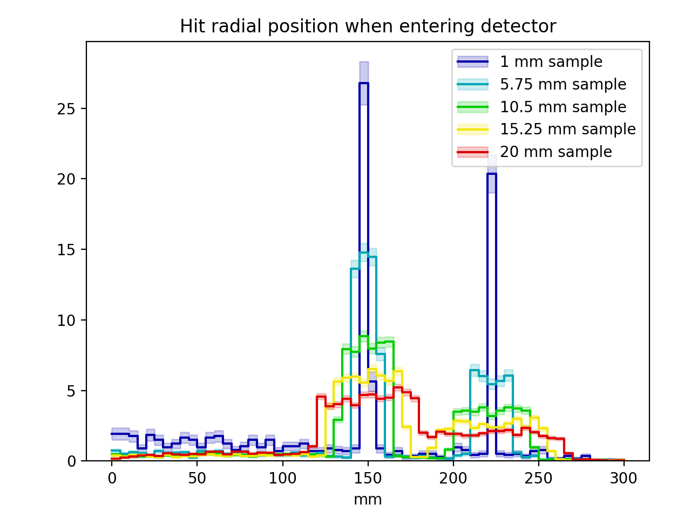
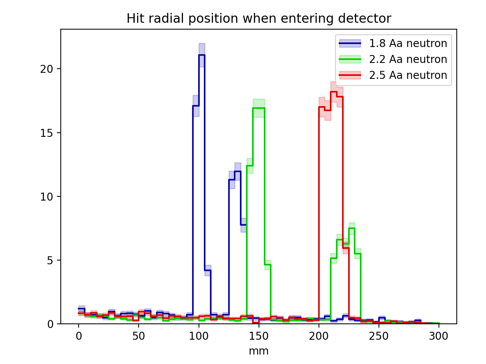

.. _sbparamscan:

**************************
Performing parameter scans
**************************

It is very common that simulations and analyses need to be run for a variety of
parameter settings (e.g. related to :ref:`geometry <sbgeo>` and :ref:`particle
sources <sbparticlegen>`), before final conclusions can be drawn. In a simple
case one might for instance, want to plot the value of some figure-of-merit as a
function of a parameter (i.e. the thickness of some geometry volume, or the
enrichment level of a particular material). Unfortunately, launching the
relevant simulation and analysis jobs manually, while keeping track of both
input parameters and output files, can be both tedious and error prone. To
facilitate this process, dgcode provides
:sbpkg:`ScanLauncher<ScanUtils/python/ScanLauncher.py>` and
:sbpkg:`ScanLoader<ScanUtils/python/ScanLoader.py>` utility classes in the
:sbpkg:`ScanUtils` package.

.. admonition:: Important notice
  :class: tip

   The usage of the scanning utilities discussed here is of course completely
   optional, and might not be particularly helpful for all use cases. For one
   thing, the workflow discussed here is centered around analyses using
   :ref:`Griff <sbgriff>` and :ref:`SimpleHists <sbsimplehists>` for the
   work. Some users might prefer to implement their own custom solutions
   instead.

Users starting their project with the :ref:`usual procedure for initialising a
new simulation project <sbnewsimproject>` will already have three skeleton
scripts in the TriCorder package prepared which make use of these utilities, in
the ``scripts/simanachain``, ``scripts/scan`` and ``scripts/scanana`` scripts
respectively. First we look at the script in the file
``TriCorder/TriCorder/scripts/simanachain``, which can be invoked with the name
``sb_tricorder_simanachain``. This simply combines the Geant4 simulation of the
:ref:`sim-script <sbsimscript>` with a :ref:`Griff <sbgriff>` analysis running
on the output of the former, and creating a :ref:`SimpleHists <sbsimplehists>`
file as a final result:

.. literalinclude:: ../build/autogen_tricorder_projdir/TriCorder/TriCorder/scripts/simanachain
  :language: python

Any command line arguments provided to the ``sb_tricorder_simanachain`` command,
are simply passed on to the ``sb_tricorder_sim`` command.

Next, still in a project named ``TriCorder``, one gets a ``scan`` script in the
file ``TriCorder/TriCorder/scripts/scan`` that can be launched with the command
``sb_tricorder_scan``. It has the contents:

.. literalinclude:: ../build/autogen_tricorder_script_scan
  :language: python

We see here that, based on the ``sb_tricorder_simanachain`` command, several of
the :ref:`sim-script <sbsimscript>` parameters are provided with fixed values at
the top (including choice of :ref:`physics list <sbphyslist>`, some
:ref:`material definitions <sbmatdef>`, and that each job must model
:math:`10^5` neutrons (a low value for purposes of having the skeleton example
run fast). After that, the actual jobs are defined in groups as desired. Here
two groups of parameter scans are defined and given names ``plot1`` and
``plot2``, which indicates their ultimate intended usage for two particular
plots. Here, the first plot will vary the sample size while generating neutrons
of a constant wavelength, and the second plot will do the opposite and vary the
neutron wavelength while keeping the sample size constant (in a more realistic
scenario one would typically have more than just a handful of values of the
varied parameter).

The command ``sb_tricorder_scan --help`` provides full usage information, but if
one for instance wishes to launch the jobs locally with up to 16 concurrent
processes (i.e. on an 8-core machines with hyperthreading), one could for
instance run::

  $> sb_tricorder_scan -qlocal -j16 -d ./my_scanresults --launch --halt-on-error

Next, one can analyse the results with the corresponding ``scanana`` script from
the file ``TriCorder/TriCorder/scripts/scan`` that can be launched with the
command ``sb_tricorder_scanana``. It has the contents:

.. literalinclude:: ../build/autogen_tricorder_script_scanana
  :language: python

The most important line here is the one invoking ``get_scan_jobs(..)``, where
the results from the scan are loaded. This places the various histograms and
other metadata from the jobs into a dictionary, which allows easy plotting in
the following lines. In this simple example, a few histograms are simply
overlaid. In a more complicated example, one might instead perform some sort of
analysis of each job, in order to extract derived values, and so on, before
providing results.

In this example, the following two plots are produced. For those curious, they
show how the Bragg reflections change as the neutron wavelength is changed,
while the peaks around each Bragg edge are blurred by multiple-scattering
effects if the sample size is increased.

