.. _sb3dvis:

Visualisation of geometry and data
==================================

When it comes to understanding one's Geant4 geometry or data, it is very useful
to be able to launch a 3D visualisation of the volumes and tracks in
question. While such visualisations lack the precision and number crunching
performance of a carefully written data-analysis, they instead have the
potential to provide quick and instant feedback on a setup, in a manner that
is very intuitive to the human developers and consumers of a simulation project.

In dgcode, we facilitate the usage of two options for 3D visualisations out of
the box: the one included in Geant4 itself, and our own custom application.

Custom 3D Viewer
----------------

In dgcode, we provide a custom `OpenSceneGraph
<https://www.openscenegraph.com/>`__-based 3D visualisation tool which can be
used to visualise both simulation geometries and data. Despite being a bit rough
around the edges (for instance it could use a better name than "CoolNameHere"),
it has already been highly useful for a lot of work so far.

Geometry visualisation
^^^^^^^^^^^^^^^^^^^^^^

Simply supply the ``--viewer`` flag to any simulation script to launch our
viewer. If for instance you have just started a :ref:`new simulation project
<sbnewsimproject>` named ``TriCorder``, the command to use will be::

  $> sb_tricorder_sim --viewer

And the viewer is launched:

|image1|

Grab the mouse and change the view as you see fit:

* **Left-click + move**: rotate view.
* **Middle-click + move**: pan view.
* **Scroll wheel** or **right-click + move**: zoom view.
* **Right-click** or **left-click+S** on a volume: center view on a selected
  point on the geometry.

|image2|

There are many more options for how to interact with a geometry, change display
style, add measurement points and coordinate axes, and so on. Hit **F1** or
**Ctrl+H** to see them summarised:

|image3|

In particular, when a Geant4 geometry is hierarchical, it is of great value to
be able to "open up" a volume to see the volumes inside it:

* **Left-click** on a volume: get information about geometry and material
  printed in the terminal.
* **Middle-click** on a volume: open it up (i.e. make it invisible) and display
  daughters (does nothing if it has no daughter volumes).
* **Left-click+W** on a volume: open up the volume by rendering it with a
  wireframe rather than simply making it invisible (if it has no daughter
  volumes, it will simply toggle the volume in and out of wireframe).
* **Shift+middle-click** on a volume: close the containing volume
  (i.e. display the containing volume normally, and hide the volume itself and
  it's "siblings").

|image4|

Simulated data visualisation
^^^^^^^^^^^^^^^^^^^^^^^^^^^^

It is pretty bare-bones at the moment, but the viewer also offers a
non-interactive view of simulated tracks along with the geometry. To get it, one
must supply the ``--dataviewer`` flag instead of the ``--viewer`` flag, and as
usual, use the ``-n`` (or ``--nevts``) flag to choose the number of events to be
simulated. So, still using the TriCorder example from :ref:`here
<sbnewsimproject>`, we can run:

.. code-block:: sh

  $> sb_tricorder_sim -n100 --dataviewer

Gives the view (nb. the coordinate axes were hidden with **ctrl+A** since they
were in the way and the spherical sample volume was turned into wireframe with a
**left-click+W**, in order to be able to see the tracks inside it):

|image5|

A pencil-beam of neutrons (green) are generated at the left side of the sample,
headed to the right. Notice how roughly 5 of the 100 neutrons had an interaction
in the sample, leading to both scatterings and generation of gammas
(yellow). For fun, here are instead 10000 neutrons:

|image6|

Which looks like neutrons are scattered in all directions. However, viewing the
scene from far away (and increasing the statistics to 100k neutrons, just
because), reveals how neutrons are scattered in nice Debye-Scherrer cones
(because the sample is polycrystalline aluminium, modelled in the powder
approximation):

|image7|

For reference, here are the particle colours (they are also printed in the
terminal):

  .. list-table::
     :header-rows: 1

     * - Particle(s)
       - Colour
     * - n
       - Green
     * - :math:`\gamma`
       - Yellow
     * - :math:`e^-`
       - Blue
     * - :math:`\mathrm{p}`
       - Red
     * - :math:`\pi^\pm`
       - Purple
     * - :math:`\alpha`
       - Cyan
     * - Lithium-7
       - Orange
     * - Others
       - White

.. _sbaimdataviewer:

Visualising generator aim
^^^^^^^^^^^^^^^^^^^^^^^^^

A very typical usage of the viewer is to debug whether the particle generator
and the geometry are positioned correctly with respect to each other (if, say,
half of the neutrons miss a detector by mistake, a less than careful analysis
might conclude that the detector efficiency is about 50% too low!).

So one might, for instance, launch the viewer with 1000 neutrons (here is the
:sbpkg:`BoronTube` simulation from the :sbpkg:`bundleroot::dgcode_val` bundle)::

  sb_borontube_sim -n1000 incidence_angle_deg=30 --dataviewer

|image_borontube_dataviewer|

It is clear that there is some sort of intense beam of neutrons passing through
the test cell (the green tube in the center), but the picture is a bit
messy. Instead, we have a special "generator aiming mode" of our viewer, in
which only the primary (i.e. generated) particles are shown, and only the very
first *segment* of each of those (to use :ref:`Griff <sbgriff>` terminology). To
use it, use the ``--aimdataviewer`` flag (or just ``--aim`` for short)::

  sb_borontube_sim -n1000 incidence_angle_deg=30 --aimdataviewer

And get:

|image_borontube_aimdataviewer|

Now it is much more clear how our generated beam intersects the
geometry. Especially since particles are no longer coloured as per their type in
this mode, but rather coloured yellow if they never hit another volume than the
one they start in, and red otherwise.

.. _sbvisgrifffile:

Visualising content of Griff file
^^^^^^^^^^^^^^^^^^^^^^^^^^^^^^^^^

It is possible to simply visualise the events inside a particular :ref:`Griff
<sbgriff>` file, by using the ``sb_g4osg_viewgriff`` command:

.. include:: ../build/autogen_g4osg_viewgriff_help.txt
  :literal:

So running ``sb_g4osg_viewgriff myfile.griff`` will visualise the tracks inside
the file ``myfile.griff``, and the ``-e`` flag can be used to pick out certain
events only. Additionally, *if* the code in the geometry module did not change
since the Griff file was produced, one can also use the ``-g`` flag to visualise
the geometry as well. So ``sb_g4osg_viewgriff -g myfile.griff`` will visualise
the tracks inside ``myfile.griff`` alongside the geometry. Crucially, this will use
the geometry parameters that were actually used when ``myfile.griff`` was
produced, and *not* their default values.

Environment variables
^^^^^^^^^^^^^^^^^^^^^

Admittedly the implementation could be improved, but as a solution for advanced
users wanting to create some specialised plots, the following environment
variables can be set in order to modify certain behaviours of the viewer (to be
run in the terminal before invoking the command to launch the viewer):

* ``export G4OSG_BGWHITE=1`` : Viewer will launch with a white background.
* ``export G4OSG_BGBLACK=1`` : Viewer will launch with a black background.
* ``export G4OSG_NOWORLDWIREFRAME=1`` : Don't show the wireframe outline of the
  world volume at launch.
* ``export G4OSG_ENDTRACKSATVOL="MyVolumeName"`` : If a track crosses a volume
  with the given name, only the track parts until the volume will be shown.
* ``export G4OSG_TRKCOLALPHA=50`` : All tracks will be 50% transparent (accepts
  number from 0..100).
* ``export G4OSG_TRKCOLR=100 G4OSG_TRKCOLB=0 G4OSG_TRKCOLG=0`` : All tracks will
  be red (rgb value r=100%, g=0%, b=0%). Numbers must be in range 0..100.
* ``export G4OSG_SKIPSECONDARIES=1`` : Only primary particles will be shown.
* ``export G4OSG_SCALEAXES=3`` : Same as user doing 3 times ``Ctrl+up arrow``
  (i.e. get bigger coordinate axes). Put to negative number to instead scale
  down.

Using Geant4's own visualisation
--------------------------------

You can provide the flag ``-v`` to any simulation script to launch Geant4's own
visualisation option. Doing so will open a secondary visualisation window and
drop you in a Geant4 interactive terminal which looks like this:

|image10|

If you have problems, you can try using the ``-e`` option to select a different
of the Geant4 drivers or "engines" (remember, you can see all the available
options for the simulation scripts by supplying the option ``--help`` or
``-h``). Upon startup, the visualisation window is completely unresponsive, and
you have to switch control from the Geant4 terminal to the visualisation window
by typing "/vis/viewer/update" or (to also simulate 10 events first)
"/run/beamOn 10". That leaves you with a view like the following:

|image11|

Now, you can't use the terminal again until you transfer control back there
(from the menu ``Miscellany``→``Exit to G4Vis>``). The Geant4 viewer is not
really interactive as such, but you can change the viewing angle by using the
menu "Actions". It is beyond the scope of the present page to go further into
the various commands that one might use in the interactive Geant4 terminal
(which btw. can be opened without the visualisation window by the flag ``-i``),
except to note that a few of the more useful commands are printed by dgcode in
the terminal (see first screenshot in this section), and refer
interested parties to the `official Geant4 documentation on visualisation
<https://geant4-userdoc.web.cern.ch/UsersGuides/ForApplicationDeveloper/html/GettingStarted/visualization.html>`__.

Note that you exit the terminal by the command "exit" (or ``ctrl+D``, like in BASH).

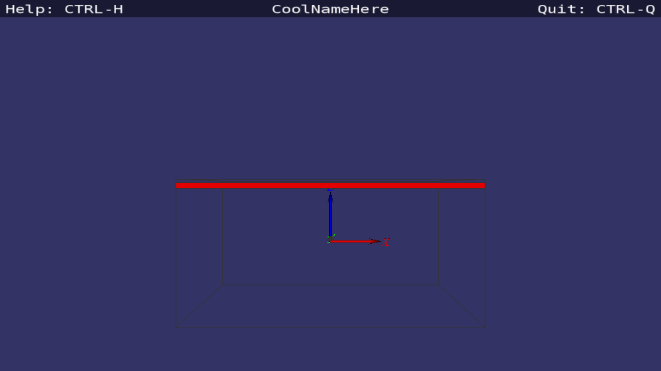
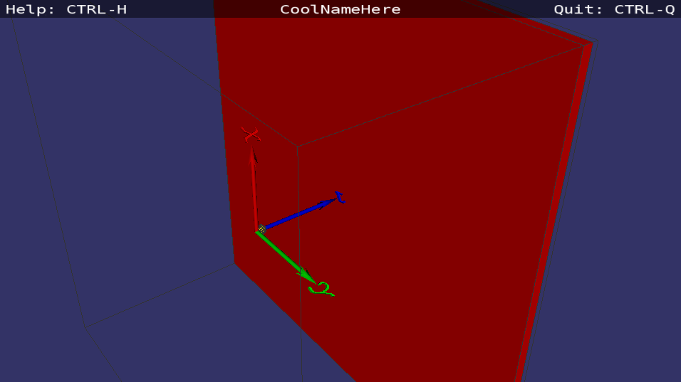
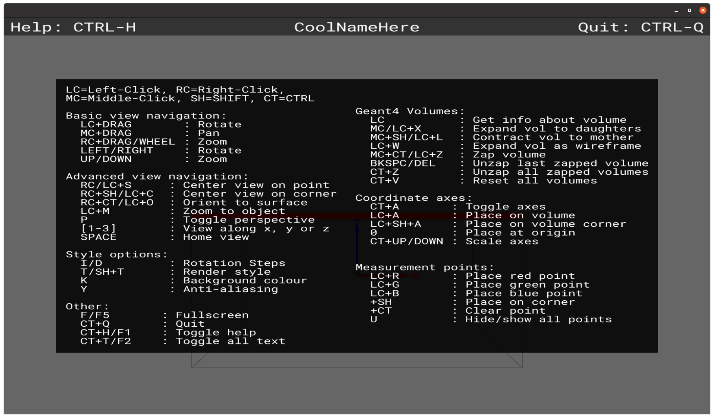
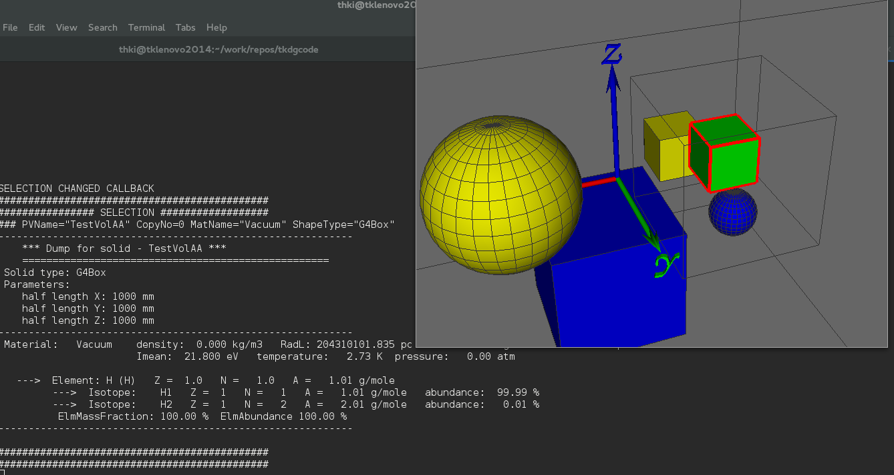
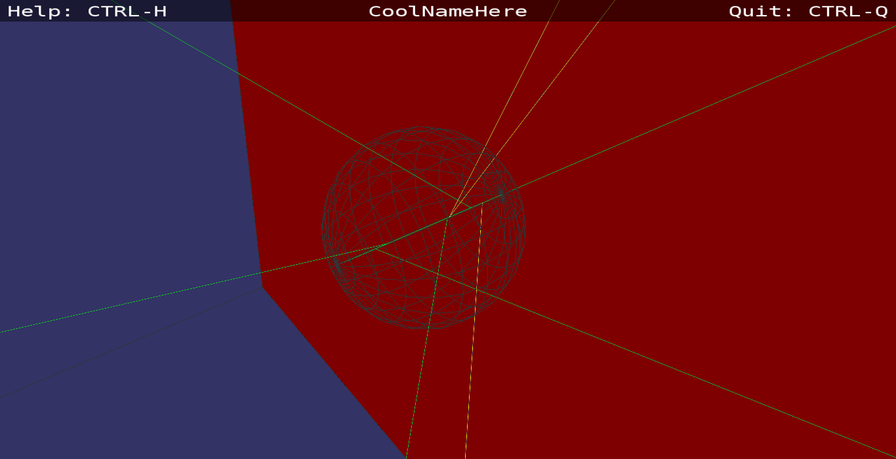
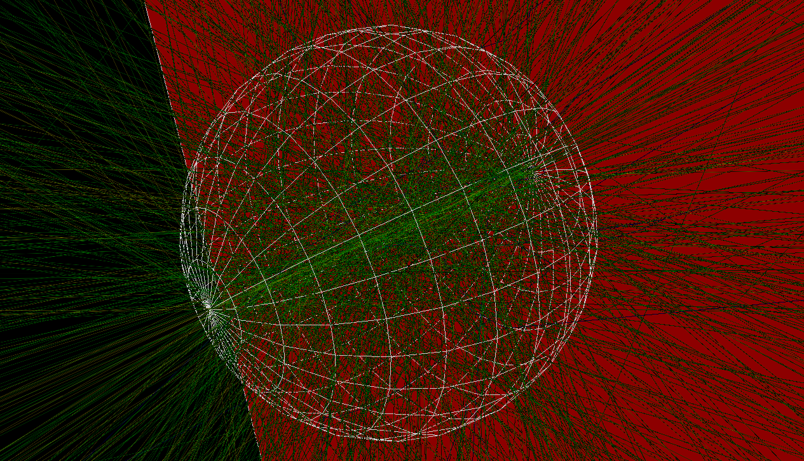
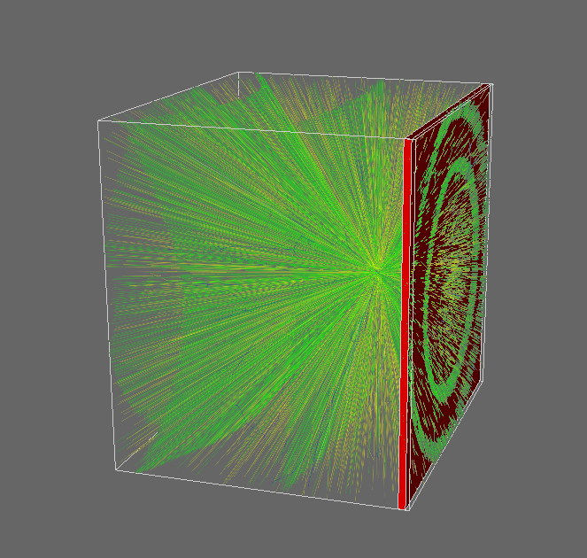
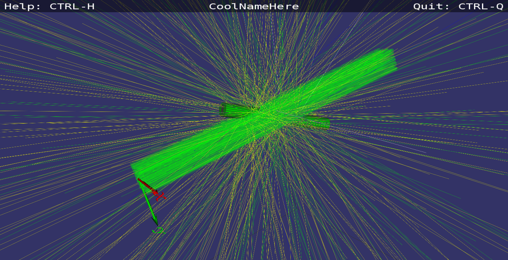
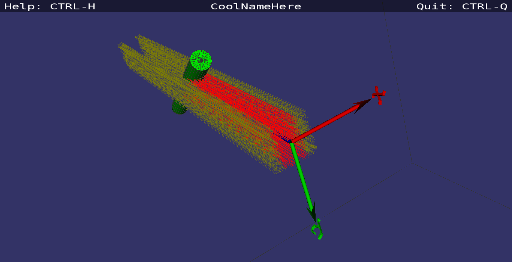
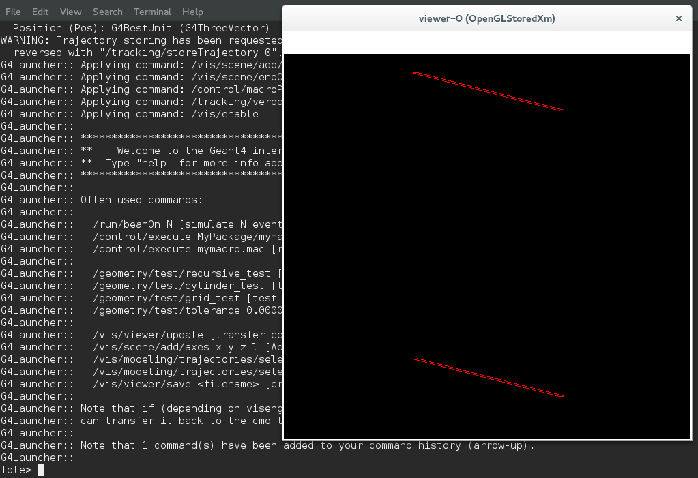
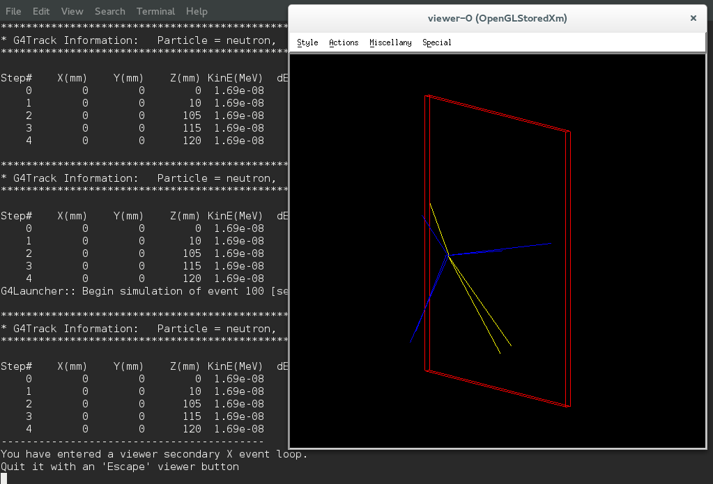
